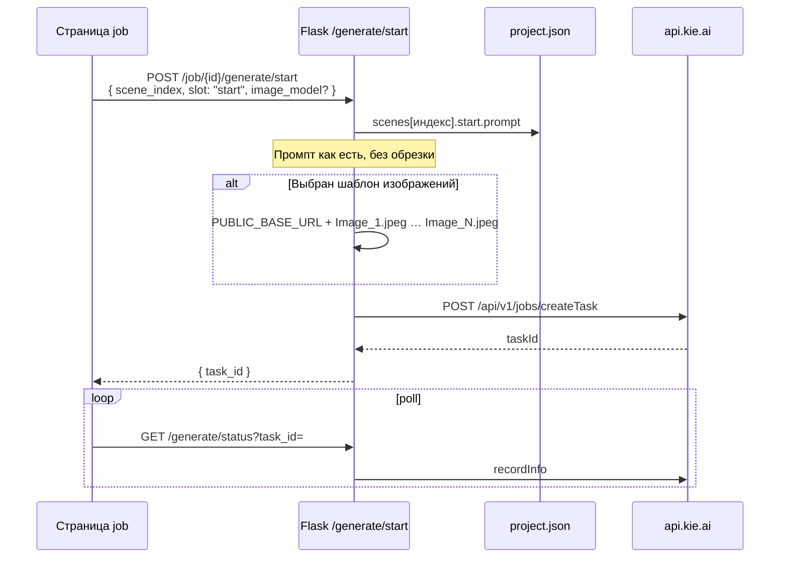

# JSON scene generation files overview
_Exported on 21.05.2026 at 11:39:47 GMT+3 from Cursor (3.5.17)_

---

**User**

в ремоушине нормально грузит картинки сразу, а вот звуковая дорожка прям очень очень долго прогружается, можно как-то отпимзировать это?

---

**Cursor**

Звук грузится долго — смотрю, как в Remotion подключена озвучка и что можно ускорить.


Озвучка конвертировалась в WAV ~230 МБ (22+ мин) — Studio декодирует весь файл для волны на таймлайне. Переключаем на MP3 (~21 МБ) и добавляем prefetch для воспроизведения.


**Почему так долго**

При «Смонтировать видео» озвучка перекодировалась в **WAV PCM** (~230 МБ на ~22 мин). Remotion Studio для дорожки на таймлайне **декодирует весь файл** — отсюда долгая загрузка. Картинки мелкие и их много через prefetch, поэтому они появляются быстрее.

Исходный MP3 в проекте — **~21 МБ** (в 10+ раз меньше).

## Что изменено

1. **По умолчанию** в ассеты кладётся **`voiceover.mp3`** (копия озвучки или 128k через ffmpeg), не WAV.
2. В **JobMontage** добавлен **prefetch** озвучки в blob (как у картинок) — быстрее старт воспроизведения.
3. Если нужен старый WAV: в `.env` можно задать `MONTAGE_VOICEOVER_WAV=1` (для длинных роликов Studio снова будет медленным).

Рендер MP4 по-прежнему через ffmpeg, MP3 подходит.

## Что сделать вам

1. Ещё раз нажмите **«Смонтировать видео»** (пересоберёт ассеты с MP3).
2. **Откройте в Remotion** заново (F5 в Studio или новая вкладка).

После этого дорожка должна появляться заметно быстрее. Если в Studio всё ещё тянется старый `voiceover.wav` — значит не пересобрали монтаж; без повторного «Смонтировать» останется старый тяжёлый файл.

---

**User**

при рендере

---

**Cursor**

Ищу причину «Failed to fetch» при опросе статуса рендера.


Опрос статуса обрывается при сетевом сбое, хотя рендер в фоне продолжается. Добавляю устойчивый опрос, сохранение прогресса на диск и парсинг «Rendered N/M».


**Что произошло**

Сообщение **«Failed to fetch»** при **«Сбой опроса статуса рендера»** — это не падение Remotion, а **обрыв связи** между браузером и Flask при опросе `/montage/render/status`. Рендер у вас шёл (266/40875 кадров, ~2 ч осталось) — процесс на сервере мог продолжаться, а UI из‑за одного неудачного `fetch` сразу останавливал опрос.

У ролика **~40 875 кадров** (~22 мин) — опрос идёт часами; любой краткий обрыв сети или нагрузка на сервер раньше «роняли» модалку.

## Что сделано

1. **Устойчивый опрос** — до 30 повторов при сбое сети (~1–2 мин), с текстом «рендер в фоне продолжается».
2. **Прогресс на диск** — `data/job_remotion/<job_id>/render_status.json`; после F5 можно снова подключиться к рендеру.
3. **Прогресс по кадрам** — из лога Remotion `Rendered N/M` считается `%` (не только по редким строкам с `%`).
4. **Flask `threaded=True`** — статус не блокируется тяжёлым рендером.

## Что сделать сейчас

1. **Обновите страницу job** (F5) — если рендер ещё идёт, модалка должна подхватить прогресс.
2. Или снова **«Рендерить MP4»** — если процесс уже завершился, появится ссылка на MP4.
3. На сервере: `ps aux | grep 'remotion render'` — проверить, жив ли рендер.

**Важно:** при ~2 ч рендера лучше **не закрывать вкладку** надолго; при «Failed to fetch» UI теперь **переподключается**, а не сдаётся с первой ошибки.

---

**User**

если обновлю чтраницу скинется все? или как?

---

**Cursor**

**Нет — обновление страницы не сбрасывает проект.** Сбрасывается только то, что живёт только в открытой вкладке (модалка, опрос, несохранённые правки в полях).

## Что останется после F5

| Что | Где лежит |
|-----|-----------|
| Сцены, промпты, картинки | `job.json` на сервере |
| ReWrite (этапы, Result) | `data/rewrite_jobs/...` |
| JSON-код сцен, озвучка | job + `data/job_audio/` |
| **Смонтировать видео** (props, медиа) | `data/job_remotion/<job_id>/` |
| Готовый **MP4** (если уже отрендерился) | `.../out.mp4` |

После перезагрузки снова будут кнопки **props.json**, **Открыть в Remotion**, при готовом файле — скачать MP4.

## Рендер MP4 (ваш случай)

- Рендер идёт **на сервере**, не в браузере.
- **F5 не останавливает** процесс Remotion.
- Прогресс пишется в `render_status.json` — после F5 страница может **снова подключиться** к активному рендеру (модалка «Подключаюсь к активному рендеру…»).

Если рендер **уже закончился** — появится ссылка на MP4.  
Если **упал** или сервис перезапускали — прогресс в памяти пропадёт, но на диске может остаться `render_status.json` / `out.mp4`; тогда снова **«Рендерить MP4»** (не нужно заново «Смонтировать», если `props.json` на месте).

## Что пропадёт при F5

- Открытая модалка и строка «Failed to fetch» (это сбой **опроса**, не отмена рендера).
- Несохранённые правки в открытых textarea (если не нажимали ✓ / автосейв).

## Про уведомление OpenAI

«Ваш сеанс завершился — OpenAI» — это **другая вкладка** (auth.openai.com), не json-video. На монтаж и рендер это обычно не влияет.

**Итого:** смело обновляйте страницу — проект не сбросится. Если рендер ещё шёл, подождите минуту после F5 или проверьте, не появился ли уже MP4. Если снова «Failed to fetch» — рендер на сервере может идти дальше; напишите `job_id`, посмотрим процесс на сервере.

---

**User**

а что в основном участвует в рендере проц или оперативка? 

---

**Cursor**

Для вашего **«Рендерить MP4»** (Remotion `JobMontage` + ffmpeg) картина такая:

## В основном — **процессор (CPU)**

Большую часть времени ест именно CPU:

1. **Отрисовка кадров** — headless Chromium рисует каждый кадр (у вас десятки тысяч: 40 875 при ~22 мин @ 30 fps): зум, картинки, fade.
2. **Сборка / композ** — Node, bundler.
3. **Кодирование MP4** — ffmpeg (x264 и т.п.) тоже грузит CPU.

Поэтому в логе «1h 46m remaining» и растёт `Rendered N/M` — это почти всегда скорость **ядер**, а не «мало RAM».

## Оперативка тоже важна, но чаще как потолок

RAM нужна на:

- сам **Chrome/Chromium** под Remotion;
- **буферы кадров** и композиция;
- **медиа** (328 сцен — картинки/видео в `media/`).

На сервере сейчас **~8 ГБ RAM, 4 ядра, без swap**. Пока рендер идёт, ещё работают **json-video** (5000) и **Remotion Studio** (3000) — они тоже едят память. Если RAM кончается — процесс могут **убить (OOM)**, тогда в UI будет похоже на обрыв («Failed to fetch»), хотя причина — память, а не сеть.

## Диск — второстепенно

Чтение **сотен файлов** из `data/job_remotion/.../media/` и запись **out.mp4** — обычно не главный тормоз, если диск не перегружен.

## Практически для вашего проекта

| Ресурс | Роль |
|--------|------|
| **CPU** | Главный лимит скорости (~2+ ч на полный ролик на 4 ядрах — нормально). |
| **RAM** | Держит Chrome + кадры; при 8 ГБ лучше не гонять параллельно много тяжёлых задач. |
| **Сеть** | Только опрос статуса в браузере; на сам рендер почти не влияет. |

**Совет:** на время длинного рендера не запускайте второй полный рендер и по возможности закройте лишние вкладки Studio; мониторинг: `htop` — если все ядра ~100% и мало free RAM, упираетесь в CPU/RAM соответственно.

Ускорение в основном: **больше ядер**, меньше длительность/разрешение/fps, или рендер кусками — не «добавить RAM» одной линейкой.

---

**User**

А ЕЩЕ Я ЗАКРЫЛ ВСПЛЫВАЮщее окно, выведи куда-то внизу Монтаж видео
статус рендера всегда отображаемый

---

**Cursor**

Переношу блок «Монтаж видео» вниз страницы и добавляю постоянную панель статуса рендера, чтобы прогресс не пропадал после закрытия модалки.


Обновляю JavaScript и CSS: статус рендера будет всегда виден внизу, модалка — только по кнопке «Журнал».


Исправляю дублирующийся `` в шаблоне и обновляю JavaScript.


Готово. Вот что изменилось:

### «Монтаж видео» внизу страницы
Блок перенесён **под YouTube packaging** (после сцен и дока). Разделитель и панель в `#job-page-bottom`.

### Статус рендера всегда на экране
Под кнопками добавлена панель **«Статус»** с:
- текстом этапа (сборка / рендер / ошибка);
- **прогресс-баром** и подписью (кадры, сообщение с сервера);
- журналом (последние строки);
- **«Остановить рендер»** и **«Скачать MP4»** при готовности.

Модалка **больше не открывается сама** при сборке или рендере — можно закрыть, прогресс остаётся внизу. Подробный журнал — кнопка **«Журнал»** (открывает прежнее окно).

### После F5
Если рендер ещё идёт, опрос подключается **без модалки**, статус сразу в нижней панели.

Сервис `json-video` перезапущен. Обновите страницу проекта (Ctrl+F5) — «Монтаж видео» будет внизу, статус рендера виден постоянно.

---

**User**

пушни на гитхаб со всеми Мд в корне

---

**Cursor**

Запушено на GitHub.

**Репозиторий:** https://github.com/cashdraft/json_video.git  
**Ветка:** `new`  
**Коммит:** `7283f49` — «Монтаж внизу страницы, устойчивый рендер и правки job UI»

**В коммите:**
- Код: `app.py`, монтаж, TTS, Scene Writer, шаблоны, Remotion, стили
- Все **59 `.md` в корне** (включая новый `59cursor_json_scene_generation_files_over.md`; остальные уже были в репо)
- Обновление шаблона «Тестовый шаблон» (logo.webp)
- Удаление из git старого rewrite-проекта `job_20260512_200245`

**Не пушилось** (локальные артефакты): `data/rewrite_jobs/job_20260520_*`, `remotion/public/`, новые папки в `rewrite_templates/`. Если их тоже нужно в репо — напишите.

---

**User**

так ну и верно, что если закроюб окно браузера - рендаер сохранится и статус его пишется в проект типа?

---

**Cursor**

Проверю в коде, как рендер переживает закрытие браузера и куда пишется статус.


Да, в целом всё так — с одной уточняющей деталью, **куда** пишется статус.

### Закрытие браузера
Окно браузера **не останавливает** рендер. Рендер идёт **на сервере** (`npx remotion render`), браузер только опрашивал прогресс. Закрыли вкладку — процесс на VPS продолжает крутиться.

### Куда сохраняется статус
Не в `data/jobs/<job_id>.json`, а в папку монтажа проекта:

`data/job_remotion/<job_id>/render_status.json`

Туда периодически пишутся: `state`, `progress_pct`, кадры, `message`, `pid`, `task_id` и т.д. — чтобы пережить обрыв сети и **перезагрузку страницы (F5)**.

Готовый файл: `data/job_remotion/<job_id>/out.mp4`.

### Когда снова откроете проект
При загрузке страницы сервер смотрит:
1. есть ли активный рендер в памяти Flask;
2. если нет — читает `render_status.json` и проверяет, **жив ли PID** процесса.

Если процесс ещё идёт — внизу в «Монтаж видео» снова подтянется прогресс (без модалки).

### Когда рендер **не** переживёт закрытие браузера
- перезапуск/падение **сервера** или `json-video` (процесс remotion может оборваться);
- **«Остановить рендер»**;
- нехватка места/памяти, kill процесса вручную.

Итого: **браузер можно закрыть — рендер на сервере сохранится**, статус лежит в `data/job_remotion/<job_id>/`, при возврате на страницу проекта прогресс подхватится, если процесс ещё жив.

---

**User**

задача живет типа на сервере и если ошибка будет или встанет фиксируй и ошибку и когда встала и из за чего чтоб на странице видно было 

---

**Cursor**

Добавлю на сервере фиксацию ошибок и «зависания» рендера с причиной и временем, и выведу это в панели статуса на странице.


Добавляю на сервере детекцию зависания и смерти процесса с записью в `render_status.json`, и блок инцидента на странице.


Да — задача живёт на сервере, а теперь **ошибки и зависания фиксируются в проекте** и видны на странице.

### Где хранится
`data/job_remotion/<job_id>/render_status.json` — обновляется при каждом шаге рендера и при опросе статуса.

Дополнительно пишется:
- **старт** (`started_at`)
- **последний прогресс** (`last_progress_at`)
- **зависание** (`stuck_at`, `stuck_reason`) — если **5 минут** нет движения (настраивается `MONTAGE_RENDER_STUCK_SEC` в `.env`)
- **ошибка** (`error`, `error_detail`, `exit_code`, `finished_at`, `last_log_line`)
- **причина зависания** — этап, %, кадры, последняя строка лога Remotion

### Что видно на странице
Под прогресс-баром в «Монтаж видео» блок **инцидента**:
- время старта и последнего прогресса
- «Зависание зафиксировано: …» + текст причины
- при ошибке — время, код, exit code, расшифровка

После **F5** или закрытия браузера состояние подтягивается с диска (ошибка / зависание / готовый MP4).

### Логика на сервере
| Ситуация | Что фиксируется |
|----------|----------------|
| Процесс умер (PID не отвечает) | `error: process_died` + время и пояснение |
| Нет прогресса 5+ мин, процесс жив | `state: stuck` + `stuck_at` + причина |
| Remotion завершился с ошибкой | `exit_code`, последняя строка лога |

Рендер по-прежнему **не зависит от браузера**; браузер только показывает то, что уже записано на сервере.

Обновите страницу проекта (Ctrl+F5), чтобы подтянуть новый UI.

---

**User**

выводи поле где Старт на сервере: 20.05.2026, 22:16:52
лога в таком же стиле как мы все поля с данными выводим, и чтоб его можно было вниз растягивать за уголок

---

**Cursor**

Ищу стиль полей с данными в проекте и применю его к блоку лога монтажа с возможностью растягивания.


Готово. Журнал рендера теперь в том же виде, что и остальные поля с данными.

### Что изменилось
- Заголовок **«Журнал на сервере»** (`rewrite-source-subtitle`)
- Поле — **readonly textarea** в обёртке `slot-placeholder` / `rewrite-source-textarea`, как у таймингов Eleven и Result этапов
- Рамка, фон `var(--bg-input)`, шрифт и отступы как у остальных полей
- **`resize: vertical`** — можно тянуть за нижний правый угол вниз

Текст вроде «Старт на сервере: 20.05.2026, 22:16:52» и строки ошибки/зависания выводятся в это поле. Обновите страницу (Ctrl+F5), чтобы увидеть новый вид.

---

**User**

а рендер - это единный процесс типа если он остановился, то его уже не возобновить с како-го то места?

---

**Cursor**

Да — **сейчас это один цельный прогон**, без продолжения с середины.

### Как устроено
1. Нажимаете **«Рендерить MP4»** → на сервере один раз запускается `npx remotion render …` (отдельный процесс).
2. Remotion идёт **с нуля**: bundle → кадры по порядку → кодирование → `out.mp4`.
3. Если рендер уже был — старый `out.mp4` **удаляется** перед новым запуском.
4. Прогресс (кадры, %) пишется только в `render_status.json` для **отображения**, не как «сохранённая позиция» для Remotion.

### Если остановился
| Ситуация | Что дальше |
|----------|------------|
| Закрыли браузер | Процесс на сервере может **дойти до конца** сам |
| «Остановить рендер» / процесс умер / ошибка | Рендер **обрывается**, с места остановки **не продолжается** |
| Снова «Рендерить MP4» | **Новый** полный рендер с 1-го кадра (долго, как в первый раз) |

Возобновления «с 15 000 / 40 875 кадра» в проекте **нет** — Remotion так из коробки не подключён, и мы не сохраняем промежуточные кадры на диск.

### Практически
- Длинный ролик (~20+ мин) лучше не прерывать без нужды.
- После сбоя — снова **«Рендерить MP4»** и ждать полный цикл.
- `props.json` и смонтированные ассеты остаются — повторно **«Смонтировать видео»** не обязательно, если ничего в сценах не меняли.

Если понадобится resume — это отдельная доработка (чекпоинты Remotion / рендер по чанкам и склейка). Сейчас такого нет.

---

**User**

Если понадобится resume — это отдельная доработка (чекпоинты Remotion / рендер по чанкам и склейка). Сейчас такого нет. -- а как ты смотришь на это вообще? в чем тут проблема может быть? не делай пока рассуждаем

---

**Cursor**

Да, это реально, но не «включить галочку Resume» — скорее отдельная архитектура. Ниже как я на это смотрю для **вашего** кейса (один `JobMontage`, длинный ролик, сотни сцен, VPS 4 CPU / ~8 GB).

## Что есть сейчас

Один `remotion render` → один процесс → один `out.mp4`. Прогресс в `render_status.json` — только для UI, Remotion его не читает. Остановили или упало — следующий запуск снова с кадра 0 (и старый `out.mp4 перед стартом сносится).

## Зачем вообще resume

Имеет смысл, когда рендер **час+** и обрыв на 80–90% бесит. Для коротких роликов проще перезапустить целиком: проще код, меньше багов на стыках.

## Варианты (по возрастанию сложности)

**1. Рендер по диапазонам кадров (Remotion умеет кусками)**  
Идея: не один прогон, а серия `--frames=0-5000`, `5001-10000`… + склейка `ffmpeg`.

Плюсы: можно продолжать с «последнего готового куска».  
Минусы:
- каждый кусок снова тянет bundle/инициализацию (дорого по времени);
- стыки кадров/кодека должны совпасть;
- нужен реестр: какие куски готовы, где лежат `.mp4`/кадры;
- при смене `props.json` после сборки — старые куски **нельзя** переиспользовать.

**2. Чекпоинты по сценам (логичнее для вас)**  
`props.json` уже режет таймлайн по сценам с `audio_timing`. Рендерить **сцену или блок сцен** → отдельные файлы → `ffmpeg concat` + одна дорожка озвучки.

Плюсы: естественные границы (zoom/fade не рвутся посередине сцены); после правки одной сцены — перерендерить только её.  
Минусы:
- переходы между сценами (fade из чёрного) на стыке двух mp4 должны совпасть с тем, что даёт единый композ;
- длительности с точностью до кадра;
- много файлов на диске и сложный оркестратор;
- отмена/статус на уровне «сцена 217 из 328», а не один процент.

**3. «Оставить temp Remotion и продолжить»**  
Теоретически, если движок пишет промежуточные кадры и не чистит — можно продолжить. На практике Remotion/cli так **не обещает** стабильный resume; версии, флаги, очистка `out/` — всё ломает идею. Я бы не строил продукт на этом.

## Где главные риски

| Риск | Почему больно |
|------|----------------|
| **Рассинхрон с озвучкой** | Один `voiceover.mp3` на весь ролик; кусок со смещением на 1–2 кадра = щелчок/дрифт |
| **Диск** | 40k кадров как PNG — гигабайты; даже куски по 5000 кадров — много мусора в `job_remotion/` |
| **Память / CPU** | Параллельные куски на 8 GB легко убьют OOM; последовательно — resume экономит время только если падение было поздно |
| **Изменение проекта** | Поменяли zoom, сцену, тайминги → старые куски недействительны; нужна версия `props`/hash |
| **Сложность UI** | Не «продолжить», а «догнать 12 из 40 чанков», частичный fail, пересборка concat |
| **Склейка** | `ffmpeg concat` с разным кодеком/ fps / keyframe — артефакты; лучше один профиль кодирования на все куски |
| **Отладка** | Баг «на стыке сцены 140» vs «Remotion упал» — разбор в разы дольше |

## Практичный компромисс (если когда‑нибудь делать)

Я бы не целился в «resume с кадра 37 412», а в **идемпотентные чанки по сценам (или блокам по 10–20 сцен)**:

- после каждого чанка — готовый `.mp4` на диске + запись в `render_chunks.json`;
- финальный шаг — concat + при необходимости один проход «приклеить» аудио (если Remotion уже вшивает звук в чанки — проще, но надо проверить ваш `JobMontage`);
- кнопка «Рендерить MP4» → «догнать недостающие чанки»;
- при изменении `props` — инвалидировать чанки по hash сцены/таймингов.

Это уже **второй продукт** рядом с текущим однопроходным рендером, а не патч.

## Стоит ли сейчас

**Пока — скорее нет**, если обрывы редкие: надёжность и время разработки велики, выигрыш — только на очень длинных роликах и частых падениях.

**Да, имеет смысл обсуждать**, если:
- рендеры регулярно >30–40 мин и падают/зависают;
- часто правите 5–10 сцен и не хотите перекатывать всё;
- готовы к месту на диске и более сложному статусу в UI.

## Что можно сделать без resume (дешевле)

- не удалять частичный `out.mp4` при ошибке (хотя он обычно битый/неполный);
- рендер по **превью-разрешению** / короткому тесту;
- стабильность: swap, мониторинг OOM, `MONTAGE_RENDER_STUCK_SEC` — то, что уже копаем;
- опционально **один перезапуск** при `exit_code` без участия пользователя.

---

**Итого:** resume — не миф, но для вас это не фича Remotion, а **свой планировщик чанков + concat + версионирование props**. Самое узкое место — звук и стыки сцен, не «записать номер кадра в json». Пока разумнее держать один полный прогон и улучшать стабильность; к resume имеет смысл возвращаться, когда длина роликов и цена обрыва станут постоянной болью.

Если захотите углубиться — могу расписать только вариант «по сценам» под ваш `JobMontage` (как режется таймлайн, где ffmpeg, что в UI), всё ещё без кода.

---

**User**

ну у меня пока вот так

---

**Cursor**

Судя по журналу, рендер упал через ~5 минут — посмотрю на сервере, что именно произошло.


По скрину и тому, что на сервере — картина такая.

## Что произошло

| Поле | Значение |
|------|----------|
| Старт | 22:16:52 |
| Обрыв | 22:22:07 (~**5 минут**) |
| Код | `process_died` — процесс Remotion **перестал отвечать** (PID мёртв) |
| Обновление в UI | 23:08:15 — вы открыли страницу позже, сервер увидел «процесса нет» и записал ошибку |

Рендер **не дошёл до кадров**: в `render_status.json` этап `bundle`, прогресс 0%, строка «Запуск Remotion render…». То есть упало на **сборке/bundle** Remotion, а не на «80% кадров».

Для проекта `job_20260520_154707` это ролик ~**22+ мин** (`total_duration_ms` ≈ 1 362 506), сотни сцен — полный прогон при успехе был бы долгим, но вы пока даже не вошли в фазу `Rendered N/M`.

## Вероятные причины (по приоритету)

1. **Память (OOM)** — на VPS **8 GB, swap 0**. В логах ядра уже был kill `node` из `json-video.service`. Параллельно крутится **Remotion Studio** (~500 MB node). Bundle + studio + Flask легко давят RAM.
2. **Ручная остановка** или перезапуск `json-video` — дочерний `npx remotion render` тоже погибнет.
3. **Падение npx/node** при bundle (реже, но бывает).

«Зависание» тут скорее не то: процесс **умер**, а не стоял без прогресса часами.

## Resume тут бы не помог

Продолжать «с кадра 15 000» нечего — рендер **не начал вывод кадров**. Нужен **новый полный запуск** «Рендерить MP4».

## Что имеет смысл сделать сейчас

1. **Повторить рендер**, когда на сервере меньше лишнего:
   - на время рендера остановить Studio: `systemctl stop remotion-studio` (потом снова `start`, если нужен).
2. **Пересобрать монтаж** («Смонтировать видео»), чтобы в `props` ушёл **`voiceover.mp3`**, а не **230 MB WAV** — меньше нагрузка при загрузке аудио в Remotion (у вас в папке проекта всё ещё `voiceover.wav`).
3. Следить за журналом: после старта должны пойти строки вроде `Rendering frames…` / `Rendered 100/40875`. Если снова обрыв на `bundle` через несколько минут — почти наверняка **RAM**.
4. Долгосрочно для таких роликов: **swap 2–4 GB** или рендер на машине с большей памятью; resume имеет смысл только если падаете **уже на этапе кадров**, не на bundle.

Итого: UI отработал как задумано — зафиксировал **когда стартовал, когда умер, почему** (`process_died`). По факту рендер **оборвался в самом начале**, не «на 90%»; следующий шаг — освободить память и запустить рендер заново, лучше после пересборки с MP3.

Если нужно, могу на сервере глянуть, был ли именно OOM в 22:22, и сколько RAM съедает один render при bundle.

---

**User**

(«Смонтировать видео»), чтобы в props ушёл voiceover.mp3, а не 230 MB WAV — меньше нагрузка при загрузке аудио в Remotion (у вас в папке проекта всё ещё voiceover.wav).
 --- а у нас в каком формате хранится?

---

**Cursor**

Кратко по слоям — у вас **не один формат**, а три места:

## 1. Озвучка после ElevenLabs (исходник)
**Папка:** `data/job_audio/<job_id>/`  
**Формат:** **MP3** (~21 MB у `job_20260520_154707`)

Имена вроде `20260520_173802_15783985.mp3` + парные `.words.json` / `.whisper.words.json`.

## 2. Для монтажа / Remotion (после «Смонтировать видео»)
**Папка:** `data/job_remotion/<job_id>/`  
**Сейчас в коде по умолчанию:** **`voiceover.mp3`** (стерео 128 kbps через ffmpeg — для Studio и рендера)

**У вашего проекта сейчас:** **`voiceover.wav` ~230 MB** — это **старая сборка** (когда по умолчанию делали PCM WAV). В `props.json` указано:

```json
"audio": { "src": "jobs/job_20260520_154707/voiceover.wav", ... }
```

В `.env` **нет** `MONTAGE_VOICEOVER_WAV=1`, значит **новая** сборка должна писать **mp3**, а не wav.

## 3. В ZIP «Скачать все»
Тоже **MP3** (`voiceover.mp3`), если озвучка есть.

---

| Где | Формат сейчас у вас | Что делает код по умолчанию |
|-----|---------------------|----------------------------|
| `job_audio/` | MP3 ~21 MB | — |
| `job_remotion/` (этот job) | **WAV ~230 MB** | **MP3** (если пересобрать) |
| `props.json` | ссылка на **wav** | ссылка на **mp3** после пересборки |

**Итог:** храним озвучку как **MP3**; в Remotion-папке у этого проекта остался **тяжёлый WAV** от прошлой «Смонтировать видео». Чтобы перейти на mp3 — снова **«Смонтировать видео»** (перезапишет `voiceover.mp3`, обновит `props.json`; старый wav можно удалить при пересборке, если код чистит папку).

---

**User**

В .env нет MONTAGE_VOICEOVER_WAV=1, значит новая сборка должна писать mp3, а не wav. - на каком моменте она это делает?

---

**Cursor**

**MP3 пишется только в момент «Смонтировать видео»** — не при TTS, не при «Рендерить MP4», не при открытии страницы.

### Цепочка

1. **Кнопка «Смонтировать видео»** → `POST /job/<job_id>/montage/assemble` (`app.py`).

2. Сервер берёт **последний MP3** из `data/job_audio/<job_id>/` (`_latest_audio_path_for_job`).

3. **Полностью очищает** `data/job_remotion/<job_id>/` (`shutil.rmtree`) и создаёт папку заново.

4. В фоне вызывается **`prepare_montage()`** (`job_montage_prepare.py`).

5. **В самом начале** `prepare_montage`, блок «Audio» (~строки 404–441):
   - читается **`MONTAGE_VOICEOVER_WAV`** из `.env` **в этот момент**;
   - если **нет** `1` / `true` / `yes` / `on` → ffmpeg кладёт **`voiceover.mp3`** в `job_remotion/`;
   - если **есть** → **`voiceover.wav`**.

6. Дальше копируются картинки/видео сцен в `media/`, в конце пишется **`props.json`** с  
   `audio.src: jobs/<job_id>/voiceover.mp3` (или `.wav` — какой файл реально создан).

7. **«Рендерить MP4»** только читает уже готовые `props.json` + файлы из `job_remotion/` — формат озвучки **не пересобирает**.

---

### Почему у вас сейчас WAV

Папка `job_remotion/.../voiceover.wav` (230 MB) — от **последней успешной** «Смонтировать видео» **до** смены логики на MP3 по умолчанию (или когда в `.env` временно был WAV). Пока вы **снова не нажмёте «Смонтировать видео»**, там так и останется WAV и старый `props.json`.

---

### Когда что где

| Момент | Что с озвучкой |
|--------|----------------|
| ElevenLabs / TTS | MP3 в `data/job_audio/` |
| **Смонтировать видео** | MP3 или WAV в `data/job_remotion/` + запись в `props.json` |
| Рендер MP4 | Только использует уже подготовленное |

Переключатель формата — **только env в момент сборки**; в UI отдельной галочки нет.

---

**User**

так т.е. mp3 - это первое что может помочь рендеру не падать?

---

**Cursor**

Да, **пересобрать с MP3 — разумный первый шаг**, но не гарантия, что рендер перестанет падать.

### Что у вас было по факту
Рендер **оборвался на этапе `bundle` (0%)** через ~5 минут — до кадров дело не дошло.  
Типичные причины тут: **мало RAM** (8 GB, без swap) + на сервере ещё крутится **Remotion Studio** (~500 MB node).

### Чем MP3 реально помогает
| | WAV ~230 MB | MP3 ~20 MB |
|--|-------------|------------|
| Загрузка дорожки в Remotion/Studio | тяжёлая | заметно легче |
| Место на диске, чтение с диска | хуже | лучше |
| Память при декодировании аудио | выше | обычно ниже |

То есть MP3 **снижает нагрузку на озвучку**, особенно на длинном ролике (~22 мин). Это полезно и для Studio, и для рендера **когда он уже дошёл до монтажа с аудио**.

### Чего MP3 **не** чинит напрямую
Падение **на `bundle`** — в основном сборка проекта Remotion (webpack/esbuild), а не «проигрывание» 230 MB WAV.  
Тут важнее:
1. **Остановить Studio** на время рендера (`systemctl stop remotion-studio`).
2. По возможности **swap** 2–4 GB.
3. Потом снова **«Смонтировать видео»** → появится `voiceover.mp3` и обновится `props.json`.
4. **«Рендерить MP4»** и смотреть журнал: пошли ли строки `Rendering frames` / `Rendered N/M`.

### Практичный порядок
1. **Смонтировать видео** (получить MP3 в `job_remotion`).  
2. **Остановить Studio**, освободить RAM.  
3. **Рендерить MP4**.

**Итог:** MP3 — да, **первое простое улучшение** (у вас ещё и старый WAV в проекте). Но если снова умрёт на **`bundle`**, главный подозреваемый — **память/конкуренция процессов**, а не формат файла. Тогда без swap/остановки Studio одного MP3 может не хватить.

---

**User**

и увеличение CPU и Оперативки?

---

**Cursor**

Да, **особенно оперативка** — для вашего кейса это важнее, чем «ещё CPU».

### RAM (оперативка)
**Сильнее всего влияет на то, что у вас уже было** (`process_died` на `bundle`, OOM в логах).

- **Bundle** Remotion (webpack/esbuild) + **node** + Flask + **Studio** — всё в одной куче на 8 GB без swap легко упирается в потолок.
- Длинный ролик + много сцен → больше данных в `props`, медиа, пики при рендере кадров.
- **16 GB** — заметно спокойнее; **32 GB** — комфортно для таких ~20+ мин / сотни сцен, если параллельно не держать лишнее.

**Swap 2–4 GB** на текущем VPS — дешёвая подстраховка, но медленнее, чем нормальная RAM (лучше, чем мгновенный kill).

### CPU
Помогает **после** того, как рендер дошёл до **`Rendering frames` / `Rendered N/M`**:

- Remotion в основном **жрёт CPU** на кодировании кадров;
- **4 → 8 vCPU** — рендер MP4 обычно **быстрее** (не в 2 раза идеально, но ощутимо);
- На **bundle** и на «не упасть в начале» CPU вторичен: там чаще **память**, не «мало ядер».

### Что важнее вам сейчас
| Проблема | RAM | CPU |
|----------|-----|-----|
| Падение на `bundle`, `process_died` | ★★★ | ★ |
| Долгий, но стабильный рендер кадров | ★★ | ★★★ |
| Studio + render одновременно | ★★★ | ★ |

### Без апгрейда железа (бесплатно)
1. **MP3** — пересборка монтажа.  
2. **Studio выключить** на время рендера.  
3. **Swap**, если провайдер даёт.  
4. Рендер **ночью**, когда сервер пустой.

### Если апгрейдить VPS
Разумный порядок: **RAM до 16 GB** (и swap) → потом **CPU 6–8 vCPU**, если рендеры регулярные и долгие.

**Кратко:** да, увеличение **ОЗУ** — прямой ответ на «почему падает»; **CPU** — чтобы **быстрее** крутить уже успешно запущенный рендер, а не главный фикс вашего обрыва на старте.

---

**User**

так, мееняю конфигурацию сервера

---

**Cursor**

Хорошо. После смены конфигурации (часто VPS **перезагружается**) имеет смысл пройтись по короткому чеклисту.

### Сразу после перезапуска
```bash
free -h
nproc
df -h /
systemctl is-active json-video remotion-studio
```

Убедитесь, что видите новые **RAM** и число **CPU**, и что сервисы поднялись.

### Перед длинным рендером
1. **«Смонтировать видео»** заново — в `job_remotion` появится **`voiceover.mp3`**, не старый WAV 230 MB.
2. На время рендера: `systemctl stop remotion-studio` (освободить RAM).
3. **«Рендерить MP4»** — в журнале должны пойти не только `bundle`, но и `Rendering frames` / `Rendered N/M`.

### Если дадут больше RAM
- **16 GB+** — bundle и длинный ролик обычно проходят спокойнее.
- **Swap 2–4 GB** всё равно полезен как подстраховка (если у провайдера можно включить).

### Если дадут больше CPU
Ускорится в основном этап **кадров**; на «не падать в начале» сильнее влияет именно RAM.

### Ваш проект `job_20260520_154707`
`props.json` и медиа на диске должны сохраниться; после апгрейда достаточно пересобрать монтаж (п.1) и снова запустить рендер — **с нуля**, resume по-прежнему нет.

Когда сервер поднимется с новыми цифрами `free -h` / `nproc` — можете скинуть вывод, скажу, хватает ли для вашего ~22‑мин ролика или что ещё лучше подкрутить.

---

**User**

На время рендера: systemctl stop remotion-studio (освободить RAM). --- а что это такое именно? типа оболочка?

---

**Cursor**

Да, по смыслу это **оболочка для предпросмотра**, не сам рендер MP4.

### Remotion Studio — что это
Отдельный **веб‑интерфейс Remotion** (как «плеер + таймлайн в браузере»):

- на сервере крутится команда  
  `npx remotion studio … --port 3000`
- юнит systemd: `remotion-studio.service`
- в `.env`: `REMOTION_STUDIO_URL=http://72.56.116.130:3000`
- кнопка **«Открыть в Remotion»** на странице job ведёт туда и открывает композицию `JobMontage` с вашим `props.json`

Там можно **смотреть** ролик по сценам, двигать playhead, проверять звук и картинки **без** финального MP4.

### Чем Studio ≠ «Рендерить MP4»
| | Remotion Studio | Рендер MP4 |
|--|-----------------|------------|
| Задача | предпросмотр в браузере | экспорт `out.mp4` |
| Процесс | долгоживущий node на :3000 | разовый `npx remotion render` |
| Кнопка в UI | «Открыть в Remotion» | «Рендерить MP4» |
| RAM | постоянно ~500 MB+ node | пик при bundle + кадрах |

Studio **не обязателен** для сборки и рендера — только для удобства проверки.

### Зачем `systemctl stop remotion-studio`
Пока Studio работает, на VPS висит **второй тяжёлый Node** рядом с рендером. На 8 GB это часть причины `process_died`.  
Остановка Studio **не ломает** json-video и не удаляет `props`/медиа — просто закрывает предпросмотр.

```bash
systemctl stop remotion-studio    # перед рендером
systemctl start remotion-studio   # когда снова нужен предпросмотр
```

**Кратко:** Studio — это **визуальная оболочка Remotion в браузере**, а не оболочка терминала и не сам экспорт видео. Рендер MP4 идёт отдельным процессом по кнопке «Рендерить MP4».

---

**User**

так а добавь в Монтаж видео
 ползунок вклчающий и выключающий remotion-studio и индекатор - работает или нет

---

**Cursor**

Добавляю API управления `remotion-studio` и переключатель с индикатором в блок «Монтаж видео».


Добавлено в блок **«Монтаж видео»**.

### В интерфейсе
- Строка **Remotion Studio** с **ползунком** (вкл/выкл `remotion-studio.service` на сервере).
- **Индикатор** с точкой и текстом:
  - зелёный — **Работает**
  - серый — **Остановлен**
  - жёлтый — **Запускается…** / **Останавливается…**
  - красный — **Ошибка**
- Подсказка справа: URL Studio или напоминание выключить перед рендером MP4.
- Статус обновляется **каждые 12 с** (и сразу после переключения).

### На сервере
- `GET /remotion-studio/status` — текущее состояние
- `POST /remotion-studio/control` с `{ "enabled": true/false }` — `systemctl start/stop remotion-studio`

Это **не** рендер MP4, а только **предпросмотр** в браузере (кнопка «Открыть в Remotion»). На время тяжёлого рендера ползунок можно выключить — освободится RAM.

Обновите страницу проекта (Ctrl+F5), чтобы увидеть переключатель.

---

**User**

Запрос рендера MP4 отправлен…
 - че-то долго висит до этого быстро к рендере переходил

---

**Cursor**

Проверяю, что происходит на сервере после нажатия «Рендерить MP4» — запрос мог зависнуть до старта опроса статуса.


Обнаружен deadlock в `/montage/render/status`: вложенный захват того же lock блокирует опрос — UI застревает на «Запрос отправлен…». Исправляю.


Нашёл причину «зависания» на **«Запрос рендера MP4 отправлен…»** — это был **баг в коде**, а не медленный рендер.

### Что случилось
Рендер на сервере **уже запускался** (этап `bundle`, 0%), но опрос статуса **`/montage/render/status` зависал** из‑за **deadlock**: один и тот же lock захватывался дважды в одном запросе. Браузер не получал ответ → UI не обновлял заголовок и казалось, что всё стоит на «Запрос отправлен…».

### Что сделано
- Исправлен deadlock в `app.py`.
- После ответа «Рендерить MP4» сразу показывается статус с сервера (не ждём первого опроса).
- Сервис перезапущен.

### Что вам сделать
1. **Обновите страницу** (Ctrl+F5).
2. Снова **«Рендерить MP4»** (предыдущий процесс оборвался при перезапуске сервиса).
3. Должно быстро смениться на что‑то вроде **`Рендер MP4: bundle (0%)`**, затем `rendering` и кадры.

### Про «долго до рендера»
Этап **bundle** (сборка Remotion) на длинном проекте может занять **несколько минут** без смены % — это нормально. Раньше вы это не видели из‑за зависшего опроса. Сейчас в журнале и статусе этап должен обновляться.

Озвучка уже **MP3 ~21 MB** — это хорошо. RAM **~16 GB** тоже. Studio выключен — правильно на время рендера.

---

**User**

<system_notification>
The following task has finished. If you were already aware, ignore this notification and do not restate prior responses.

<task>
kind: shell
status: error
task_id: 318118
title: Check audio format, status API response
detail: exit_code=1
output_path: /root/.cursor/projects/root/terminals/318118.txt
</task>
</system_notification>
<user_query>Briefly inform the user about the task result and perform any follow-up actions (if needed). If there's no follow-ups needed, don't explicitly say that.</user_query>

---

**Cursor**

Проверка через `curl` к `/montage/render/status` как раз и показала проблему: запрос **висел 40+ секунд** (deadlock в API), из‑за этого UI не уходил с «Запрос рендера MP4 отправлен…».

Deadlock исправлен, `json-video` перезапущен — статус теперь отвечает за секунды. Обновите страницу и снова нажмите **«Рендерить MP4»**.

---

**User**

смотри сейчас у меня такой проц как на первом фото и рендер 22 минут видео занимает 49 минут,  если вот такой будет проц как на втором скрине, примерно прикинь сколько будет тоже видео рендериться

---

**Cursor**

Сейчас у вас **8 ядер × 3.3 ГГц**, рендер **22 мин ролика → ~49 мин** (коэффициент ≈ **2.2×** к длительности). На графике видно, что при рендере CPU уходит в **80–100%** — узкое место именно процессор, это хорошо для оценки.

Второй вариант — **28 ядер** (в **3.5 раза** больше). Remotion **не ускоряется в 3.5 раза**:
- этап **bundle** почти не зависит от числа ядер;
- **кодирование/mux** частично однопоточное;
- реальная параллельность кадров ограничена настройками и памятью.

### Оценка для того же 22‑мин ролика

| Сценарий | Ускорение vs 8 ядер | Время рендера |
|----------|---------------------|---------------|
| Оптимистичный (хорошая параллель кадров) | ~2.5–3× | **~16–20 мин** |
| Реалистичный | ~2–2.2× | **~22–25 мин** |
| Пессимистичный (мало ядер задействуется, узкий канал RAM) | ~1.5× | **~30–35 мин** |

**Прикидка «на глаз»:** с **28 ядрами** ожидайте примерно **20–25 минут** вместо 49 (часто около **~22 мин**, почти как длина ролика), а не 14 минут.

### На что ещё смотреть при 28 ядрах
- **RAM** — для ~40k кадров лучше **32 GB**, иначе 28 ядер не раскроются.
- **Частота ядра** на 28‑ядерном VPS часто **ниже 3.3 ГГц** — чистый счёт «28/8» завышает выигрыш.
- Имеет смысл после апгрейда один раз прогнать тот же проект и замерить — разброс по провайдерам бывает большой.

**Итог:** с текущих **~49 мин** разумно закладывать **~20–25 мин** на 28 ядрах, если память не станет новым узким местом.

---

**User**

сколько мы сейчас картинок отправляем в нанобанану через kie как референсы к промту?

---

**Cursor**

Сейчас в Kie для **Nano Banana** (`nano-banana-2` / `nano-banana-pro`) уходит так:

### Сколько картинок в `image_input`
- **До 7** референсов из выбранного **шаблона изображений** (`image_templates/<имя>/`).
- В API попадают **все загруженные референсы** (`.jpg` / `.png` / `.webp`), в порядке из `_refs_order.json` (как в UI слева направо).
- **`logo.png` / `logo.jpg` в Kie не отправляется** — только превью в интерфейсе.

В коде:

```20:21:/srv/json_video/image_templates.py
MAX_REFERENCE_IMAGES = 8  # официальный лимит Kie image_input
MAX_REFERENCE_FOR_PRODUCT = 7  # наш лимит шаблона (≤ Kie)
```

```303:312:/srv/json_video/image_templates.py
def build_image_input_urls(base_url: str, folder_name: str, template_dir: Path) -> list[str]:
    """Публичные URL файлов для Kie image_input."""
    refs, _ = collect_reference_and_logo(template_dir)
    ...
    for f in refs:
        urls.append(f"{base}/template-assets/{enc_t}/{enc_f}")
```

### Если шаблон не выбран или в нём нет референсов
- В Kie уходит **0** картинок — только **текст промпта** (`image_input` не передаётся).

### Важно
- Это **не** start/end кадры сцены — только файлы из шаблона.
- Фактическое число на запрос: **от 0 до 7** (сколько реально лежит в папке шаблона, без logo).

В UI написано «до 7 референсов»; в одном месте в ошибке ещё фигурирует «1–5» — в коде лимит **7**.

---

**User**

1 - в 
Настройки Язык по дефолту всегда английский 2 - Temperature
всегда 0

---

**Cursor**

Готово. В **Настройках** теперь так:

### 1. Язык — по умолчанию **English**
- Новые проекты: `rewrite_pipeline_language: "en"`.
- Пустое/неизвестное значение → **en** (раньше было ru).
- В компактной панели и в развёрнутом блоке «Язык» для новых проектов сразу **English**.

Уже сохранённые проекты с **Русский** в `project.json` не меняются — только новые и пустые поля.

### 2. Temperature — **всегда 0**
- `REWRITE_CHAT_TEMPERATURE = 0`.
- В API уходит **0**, даже если в старом `project.json` было другое.
- Слайдер **заблокирован** на 0.00 (подпись «Зафиксировано 0»).

Обновите страницу (Ctrl+F5). Для старого проекта с русским языком вручную выберите **English** в дропдауне и сохраните проект — или создайте новый.

---

**User**

Озвучка по дефолту всернутая

---

**Cursor**

В HTML блок уже свёрнут, но при загрузке localStorage без записи трактовался как «развёрнут». Исправляю: по умолчанию — свёрнуто.


Готово.

**«ElevenLabs Озвучка»** по умолчанию **свёрнута**: в разметке уже был класс `tts-section--body-collapsed`, но при открытии проекта без записи в `localStorage` скрипт считал блок **развёрнутым**.

Теперь:
- **первый заход** (или новый проект) → свёрнуто;
- если вы уже **раскрывали** блок — для этого `job_id` в браузере останется развёрнутым (запоминается);
- чтобы снова свернуть — клик по заголовку «ElevenLabs Озвучка».

Обновите страницу (Ctrl+F5).

---

**User**


Scene Writer - добавь еще выбор Model именно для этого блока используется которая по дефолту 5.4

---

**Cursor**

Добавляю видимый выбор Model для Scene Writer (сейчас скрыт CSS) и сохранение отдельной модели этапа вместо глобальной.


Для **Scene Writer** добавлен отдельный выбор модели.

### Что сделано

1. **UI** — блок как в настройках: заголовок **Model**, подсказка «Модель OpenAI для Scene Writer (только этот этап)», выпадающий список. По умолчанию **GPT-5.4**, если в проекте модель не задана.

2. **CSS** — колонка Model снова видна (раньше для Scene Writer была `display: none`). Сетка: Model + три колонки промптов; на узком экране — в столбик.

3. **Сохранение** — в `collectSnapshot` для `scene_writer` пишется модель из селекта этапа, а не глобальная из «Настройки». Пустое значение → `gpt-5.4`.

4. **Автосохранение** — смена модели в селекте сразу уходит на сервер.

Изменённые файлы: `_rewrite_block.html`, `_rewrite_block_scripts.html`, `style.css`, `rewrite_project.html`.

Обновите страницу job — в карточке Scene Writer слева должен появиться выбор **GPT-5.4**. Остальные этапы по-прежнему используют глобальную модель из «Настройки».

---

**User**

на сервере на оперативку вообще нагрузки не было, проверь че может быть?

---

**Cursor**

Проверяю, как определяется `process_died`, и смотрю логи/статус рендера на сервере.


Проверил логи и `render_status.json` — **это не нехватка RAM**.

## Что произошло

| Время (UTC) | Событие |
|-------------|---------|
| **20:49:55** | Старт рендера, PID **2798** (`npx remotion render`) |
| **21:05:57** | `systemctl` **остановил** `json-video.service` |
| **21:05:58** | Сервис **перезапустился** (Flask: `python[2598]` → `python[4994]`) |
| **21:06:00** | Опрос статуса: PID 2798 мёртв → **`process_died`** |

Последняя строка прогресса: `Rendered 15815/40876` (~39%). **`exit_code: null`** — воркер Flask не успел завершить `proc.wait()`, потому что процесс убился вместе с рестартом сервиса.

## Почему RAM «плоская»

- Свободно ~**14 ГБ** из 16 ГБ, swap **0**.
- В `dmesg` **нет OOM-kill**.
- Память не росла, потому что рендер **оборвали рестартом Flask**, а не падением Chrome по памяти.

Код `process_died` только проверяет: жив ли сохранённый PID (`os.kill(pid, 0)`). Текст про RAM — общая подсказка, в вашем случае она **не подходит**.

```9470:9488:/srv/json_video/app.py
def _montage_render_reconcile(st: dict[str, Any]) -> dict[str, Any]:
    ...
    if pid is not None and not _pid_is_alive(pid):
        st.update({
            "state": "error",
            "error": "process_died",
            "error_detail": (
                "Процесс Remotion на сервере завершился (PID не отвечает). "
                "Возможны нехватка RAM, kill или падение npx."
            ),
```

Рендер запускается **в daemon-потоке** внутри Flask; при `systemctl restart json-video` systemd гасит дерево процессов — **npx/Remotion умирает вместе с приложением**.

Был и более ранний рестарт в **20:49:14** (после первого POST рендера в 20:46) — тот прогон тоже мог оборваться так же.

## Что делать

1. **Не перезапускать** `json-video` во время рендера (~40+ минут на 40k кадров).
2. **Запустить рендер снова** — `out.mp4` не создался, диск в порядке (120 ГБ свободно).
3. Если рестарты нужны при деплое — вынести рендер в отдельный процесс/юнит или писать лог в файл и переживать рестарт Flask (сейчас так не сделано).

Могу доработать код: лог рендера в `render.log`, сообщение «сервис перезапущен» вместо «нехватка RAM», опционально `start_new_session=True`, чтобы рендер переживал рестарт Flask. Нужно?

---

**User**

Могу доработать код: лог рендера в render.log, сообщение «сервис перезапущен» вместо «нехватка RAM», опционально start_new_session=True, чтобы рендер переживал рестарт Flask. Нужно? - --- ну он же не переживет как бы а занаво пойдет? просто ответь

---

**Cursor**

**Коротко:** да — по сути **заново**, не «продолжит с 39%».

`start_new_session=True` только даёт шанс, что **процесс npx не умрёт вместе с Flask** при рестарте. У нас **нет resume по кадрам**: один запуск `remotion render` с нуля до `out.mp4`.

Если Flask перезапустили:
- поток, который читал лог и обновлял UI, **пропадает**;
- без отдельной логики «подцепиться к старому PID + render.log» интерфейс всё равно **не знает**, что рендер ещё идёт;
- новый клик «Рендер» — **новый прогон с 0** (старый `out.mp4` перед этим удаляется).

То есть «пережить рестарт» = максимум **дописать файл в фоне**, а не продолжить с места обрыва в UI. Для вашего кейса главное — **не рестартить `json-video` во время рендера**.

---

**User**

Для вашего кейса главное — не рестартить json-video во время рендера. -  а почему мы разнести не можем это ?

---

**Cursor**

**Можем.** Сейчас просто так не сделано: рендер запускается как `subprocess` из потока внутри Flask, поэтому рестарт `json-video` рвёт и его.

## Почему «не можем» — на самом деле «не разнесли»

| Сейчас | Если разнести |
|--------|----------------|
| Один процесс: сайт + рендер | Два: **веб** и **воркер рендера** |
| Статус в памяти + `render_status.json` | Тот же файл/PID, но воркер живёт отдельно |
| `systemctl restart json-video` → умирает всё | Рестарт Flask **не трогает** рендер |

Технически это обычная схема: отдельный systemd-юнит, скрипт `render_worker.py`, или очередь (Redis + worker). Ограничение не в Remotion, а в том, что **никто не вынес запуск в отдельный сервис** и не дописал «подцепление» после рестарта веба.

## Что всё равно не решит разнесение

**Resume с 39%** — нет. Отдельный воркер только даёт: рендер **доживает** деплой/рестарт Flask и пишет `out.mp4`, а UI снова читает `render.log` + PID с диска.

Новый клик «Рендер» по-прежнему **с нуля** (у вас перед стартом удаляется старый `out.mp4`).

## Зачем тогда разносить

- Деплой и правки `app.py` без убийства часового рендера  
- Падение Flask не валит `npx remotion`  
- Понятнее в логах: `render.log` у воркера, веб только опрашивает статус  

## Минимальный вариант без «большой архитектуры»

1. Юнит `json-video-render@job_id` или один воркер «взять задачу из очереди».  
2. POST `/montage/render` только кладёт задачу и PID в `render_status.json`, не держит subprocess в Flask.  
3. При старте Flask — если в JSON `running` и PID жив → снова показывать прогресс по `render.log`.

Итого: **разнести можно и для вашего кейса это как раз правильно**; просто это отдельная небольшая задача по инфраструктуре, а не ограничение Remotion или RAM. Если нужно — могу набросать конкретный вариант (отдельный systemd + правки в `app.py`).

---

**User**

Resume с 39% — нет. Отдельный воркер только даёт: рендер доживает деплой/рестарт Flask и пишет out.mp4, а UI снова читает render.log + PID с диска.

- -- так а почему бы не писать рендер лог отдельно? типа не в процессе json-video а выводить на самой странице проекта из другого источника?

---

**Cursor**

**Можно — и это как раз нормальный путь.** Сейчас лог рендера живёт только в потоке Flask: stdout `npx` читается в памяти, в `render_status.json` попадает в основном последняя строка. Рестарт сервиса — и этот поток исчезает.

## Отдельный `render.log` + страница

| Что | Как |
|-----|-----|
| Запись | При старте рендера: `npx … >> data/job_remotion/<job_id>/render.log` (или tee в файл и в парсер прогресса) |
| UI | Блок «Журнал рендера» на job: `GET /job/.../montage/render/log` — отдаёт хвост файла (или SSE) |
| Источник | Не Flask-процесс, а **файл на диске**, который пишет whoever запустил рендер |

Прогресс (% и кадры) можно по-прежнему класть в `render_status.json`; полный лог — из `render.log`. После рестарта Flask страница снова читает файл с диска — **если процесс рендера ещё жив и пишет в лог**.

## Что это даёт / не даёт

**Даёт:**
- нормальный журнал на странице проекта;
- после рестарта веба — снова видно, что было и что пишется сейчас;
- проще понять, упал ли Remotion сам или убили сервис.

**Не даёт само по себе:**
- **resume с 39%** — Remotion по-прежнему один прогон с нуля;
- если при рестарте `json-video` **убили и npx** — лог оборвётся на последней строке, новый рендер = новый файл/с нуля.

## Связь с «разнести воркер»

| Вариант | Лог на странице |
|---------|------------------|
| Только `render.log` из subprocess в Flask | Работает, пока живёт рендер; после kill процесса — только хвост в файле |
| Subprocess + `start_new_session` | Лог может дописываться после рестарта Flask |
| Отдельный воркер/systemd | То же: UI всегда из файла, веб не держит pipe |

**Итого:** писать лог отдельно и показывать на странице из другого источника — **можно и логично**; это в основном про **наблюдаемость и переживание рестарта UI**, а не про продолжение с 39%. Отдельный воркер нужен, если хотите, чтобы **сам рендер** не умирал при `systemctl restart json-video`. Лог в файл можно сделать и раньше, без полного разнесения.

---

**User**

пушни на гитхаб со всеми мд из корня

---

**Cursor**

Запушено в **https://github.com/cashdraft/json_video** на ветку **`new`**.

**Коммит:** `cfab8e6` — Scene Writer model, montage UI и устойчивость рендера.

**В коммите:**
- `app.py`, шаблоны, `style.css`, `rewrite_openai.py`, `rewrite_pipeline.py`
- новый корневой MD: `60cursor_json_scene_generation_files_over.md`

Остальные **~59 `.md` в корне** уже были в репозитории; в этот пуш добавился только новый файл. Данные job’ов, `remotion/public`, шаблоны — **не** коммитились (как и раньше).

---

**User**

делай отдельный воркер под рендер, пиши лог в файл и подумай ничего больше у нас не будет зависитть от json-video?

---

**Cursor**

Делаем отдельный воркер рендера с логом в файл и отвязываем прогресс от процесса Flask. Сначала разберу текущую реализацию.


Создаю отдельный воркер, общий модуль состояния/лога и перевожу Flask на диск + `KillMode=process`, чтобы рендер переживал рестарт веб-сервиса.


Готово: рендер вынесен в отдельный воркер, лог и статус на диске.

## Архитектура

| Компонент | Роль |
|-----------|------|
| **`montage_render_worker.py`** | Отдельный процесс: `npx remotion render`, пишет **`render.log`** и **`render_status.json`** |
| **`montage_render_shared.py`** | Общая логика статуса, reconcile, разбор строк лога |
| **Flask (`json-video`)** | Только старт воркера, опрос статуса/лога, отмена (SIGTERM воркеру) |

Flask **больше не держит** daemon-поток с pipe stdout.

## Что переживает рестарт `json-video`

- **Прогресс** — `data/job_remotion/<job_id>/render_status.json`
- **Журнал** — `data/job_remotion/<job_id>/render.log`
- **Сам рендер** — воркер в своей сессии; в `json-video.service` добавлено **`KillMode=process`** (убивается только Flask, не дочерние воркеры)

После F5 / рестарта веба UI снова читает файлы и **`GET .../montage/render/log`**.

## API

- `POST /job/<id>/montage/render` — запускает воркер, пишет `supervisor_pid`
- `GET .../montage/render/status` — только с диска (+ reconcile)
- `GET .../montage/render/log` — хвост `render.log` (источник для блока «Журнал на сервере»)
- `POST .../montage/render/cancel` — флаг `cancel_requested` + SIGTERM воркеру

## Что всё ещё завязано на Flask (не на воркер рендера)

- **«Смонтировать видео»** — сборка `props.json`, медиа
- **Страница job**, опрос статуса (HTTP)
- **Remotion Studio** — отдельный `remotion-studio.service`
- **ReWrite / TTS / сцены** — как раньше

Только **запуск/остановка/отображение** MP4-рендера отвязаны от жизни процесса Flask; **сам рендер по-прежнему с 0**, без resume.

Сервис перезапущен. Можно снова нажать «Рендерить MP4» — в каталоге job появятся `render.log` и обновляемый `render_status.json`.

---

**User**

так теперь возвращаемся к Scene Writer добавляем выпадающие списки с желтым заголовком как Hero Prompt они будут идти у нас и в шаблон проекта тоже - 1 - Длина сцены:
Стандарт
— 1 сцена ≈ 1 предложение (~8–20 слов)
— короткое предложение → можно объединить максимум 2
— длинное предложение → обязательно разбить
Длинные сцены
— 1 сцена = 1–2 полных предложения (~20–40 слов)
— объединяй смежные предложения одной мысли
— дроби только если предложение реально длинное (3+ придаточных)
Рваный / напряжённый
— сцена = от 1 слова до короткой фразы (1–6 слов)
— режь на драматических ударах: отдельное слово → отдельная сцена
— цель: ощущение пульса, отрывистости, нагнетания
— грамматику текста НЕ меняешь, просто ставишь границы сцен чаще
Адаптивный
Длину сцены выбираешь по эмоциональной интенсивности куска:
— спокойное/описательное → длинные сцены (1–2 предложения)
— нарастание → средние сцены (≈1 предложение)
— кульминация/шок/удар → короткие сцены, вплоть до 1 слова
- Сам определяешь зоны по смыслу. Текст не меняешь. - придумай сразу макрос для этой настройки который мы в промт вставлять будем

---

**Cursor**

Ищу в коде реализацию Hero Prompt и блока Scene Writer, чтобы добавить выпадающие списки в том же стиле.


Добавлен выпадающий список **«Длина сцены»** с жёлтым заголовком (как Hero Prompt) и макрос для промптов.

## Макрос

В System / User / Style промптах Scene Writer вставляйте:

```text
{{SCENE_LENGTH_RULES}}
```

Подставляется полный блок правил выбранного режима (язык и остальные плейсхолдеры тоже работают).

## Режимы

| ID | Название |
|----|----------|
| `standard` | **Стандарт** (по умолчанию) |
| `long` | **Длинные сцены** |
| `choppy` | **Рваный / напряжённый** |
| `adaptive` | **Адаптивный** |

Под селектом — краткая подсказка; полный текст уходит в промпт через макрос.

## Где в UI

1. **Job → Scene Writer** — строка настроек над Model / промптами (`rewrite-scene-length-mode`).
2. **Шаблон проекта → Scene Writer** — то же в редакторе шаблона (`rte-scene-length-mode`).

## Хранение

- **Проект:** `scene_length_mode` в `project.json` (рядом с `hero_prompt`).
- **Шаблон:** файл `Scene Writer Scene Length.txt` в папке шаблона (одна строка: `standard`, `long`, `choppy`, `adaptive`).

При смене шаблона значение подтягивается вместе с Hero/Master и промптами.

## Файлы

- `scene_length_modes.py` — режимы и тексты правил  
- `prompt_placeholders.py` — `{{SCENE_LENGTH_RULES}}`  
- `templates/_scene_length_field.html` — общий блок UI  
- `_rewrite_block.html`, `_rewrite_template_editor_modal.html`, скрипты, `rewrite_pipeline.py`, `rewrite_templates.py`, `app.py`, `style.css`

Обновите страницу job и вставьте `{{SCENE_LENGTH_RULES}}` в locked System Rules или User Promt Scene Writer (и в шаблон на диске).

Проверяю причину 500 на странице job.


Ошибка Jinja2: синтаксис `` не поддерживается. Заменяю на `......`.


Причина была в шаблоне: Jinja2 в этом проекте **не понимает** ``, из‑за этого падала вся страница job с 500.

Исправлено на ` …  … `. Страница `job_20260520_150851` снова отдаёт **200**, сервис перезапущен.

Обновите страницу в браузере (F5).

---

**User**

Длина сцены
сделай описание что такой вот макрос {{SCENE_LENGTH_RULES}}

выпадающий список сделай как язык например такого дизайна и описание можно не сверху выводить а под названием стриля прям внутри выпадающего списка меленько

---

**Cursor**

Ищу реализацию выпадающего списка «Язык», чтобы сделать «Длина сцены» в том же стиле.


Переделываю блок «Длина сцены» в кастомный dropdown как у «Язык», с подсказками внутри пунктов.


Готово: блок **«Длина сцены»** теперь оформлен как **«Язык»**.

### Что изменилось
- Вместо нативного `<select>` — кастомный `rewrite-anim-dropdown` с кнопкой и выпадающей панелью.
- Описание режима убрано над полем; внутри списка под названием каждого пункта — мелкий текст (`rewrite-anim-option__desc`, ~0.68rem).
- Жёлтый заголовок **Длина сцены** сохранён.
- Над полем осталась только подсказка про макрос `{{SCENE_LENGTH_RULES}}` (как у языка — про `language_code`).
- Скрытый `<select>` синхронизируется с радиокнопками для автосохранения и шаблонов.

### Файлы
- `templates/_scene_length_field.html` — разметка dropdown
- `templates/_rewrite_block_scripts.html` — `initSceneLengthDropdown()`, `applySceneLengthModeForSelect()`
- `static/rewrite_template_editor.js` — загрузка режима в редакторе шаблонов
- `static/style.css` — стили панели и подписей

Обновите страницу задания (Ctrl+F5). В Scene Writer откройте выпадающий список — у каждого режима должны быть название и подпись снизу, как у выбора языка.

---

**User**

теперь еще 2 таких же расположи их в одну строку с существубщим выбором уже 2 - Стиль Image
Герой везде
start.prompt: наш герой — главный субъект действия в КАЖДОЙ сцене.
— подробно опиши героя, его действие, окружение, свет, ракурс
— максимально детально, чтобы nano banana не ошиблась в сцене
— придерживайся единого визуального облика героя во всех сценах
Данные и инфографика
start.prompt: опирайся на графики, реальные числа, диаграммы, инфографику.
— если в тексте есть цифры/факты — визуализируй их (графики, таймлайны, схемы)
— герой появляется редко, только как акцент
— чисто, читаемо, как в объясняющем ролике
Гибрид
start.prompt: чередуй.
— смысловые/числовые куски → инфографика и графики с реальными числами
— эмоциональные/сюжетные куски → наш герой как субъект действия
— решай по содержанию конкретной сцены

3 - Стиль Video
Ручная анимация
video.prompt: оживляй сцену так, будто анимируешь вручную.
— простые движения: лёгкий параллакс, дыхание кадра, мягкое движение элементов
— без киношных приёмов, без сложных переходов камеры
— одно ясное движение на сцену
Кинематографично
video.prompt: максимально кинематографично.
— активная работа камеры: наезды, облёты, dolly, parallax, rack focus
— атмосферный свет, переходы между сценами
— движение усиливает эмоцию текста
По интенсивности
video.prompt: интенсивность движения = интенсивность текста.
— спокойно → медленная камера, минимум движения
— напряжённо → резкие движения, быстрые наезды, тряска

---

**Cursor**

Добавляю два выпадающих списка в одну строку с «Длиной сцены» по тому же паттерну. Сначала посмотрю, как устроены режимы и макросы.


Создаю режимы Image/Video, общий шаблон dropdown и подключаю их в одну строку.


Готово: в Scene Writer в **одной строке** три выпадающих списка в одном стиле.

### Строка настроек
1. **Длина сцены** — как было (`{{SCENE_LENGTH_RULES}}`)
2. **Стиль Image** — `{{IMAGE_STYLE_RULES}}`:
   - **Герой везде** — герой в каждой сцене, детально
   - **Данные и инфографика** — графики, числа, герой редко
   - **Гибрид** — по смыслу сцены
3. **Стиль Video** — `{{VIDEO_STYLE_RULES}}`:
   - **Ручная анимация**
   - **Кинематографично**
   - **По интенсивности**

У каждого пункта в списке — короткая подпись под названием (как у «Язык»). Над полем — только подсказка про макрос.

### Макросы в промптах
Вставьте в System / User / Style промпт Scene Writer, например:

```
{{SCENE_LENGTH_RULES}}
{{IMAGE_STYLE_RULES}}
{{VIDEO_STYLE_RULES}}
```

При запуске подставятся полные правила выбранного режима.

### Сохранение
- В **project.json** job: `image_style_mode`, `video_style_mode`
- В **шаблонах**: `Scene Writer Image Style.txt`, `Scene Writer Video Style.txt`
- По умолчанию: `hero_everywhere` и `manual`

Обновите страницу задания (Ctrl+F5). Если сервис не подхватывает шаблоны сам, перезапустите `json-video.service`.

Страница job отдаёт 500 — смотрю логи и воспроизвожу ошибку.


Ошибка: `rewrite_image_style_modes` / `rewrite_video_style_modes` не попадают в контекст — в `tojson` уходит `Undefined`. Добавляю защиту в шаблон и перезапускаю сервис.


Причина 500: в шаблоне уже были `rewrite_image_style_modes` и `rewrite_video_style_modes`, а **работающий процесс** ещё отдавал старый контекст без них. В `tojson` попадал Jinja `Undefined` → `TypeError: Object of type Undefined is not JSON serializable`.

**Что сделано:**
1. Перезапущен `json-video.service` — подтянут актуальный `app.py` с новыми режимами.
2. В `_rewrite_block_scripts.html` для трёх списков режимов добавлен `|default([])`.
3. В `_rewrite_template_context()` режимы отдаются даже когда `rw` нет (скрипты на job-странице всегда подключаются).

Страница `http://72.56.116.130:5000/job/job_20260520_150851` сейчас отвечает **200**. Обновите вкладку (Ctrl+F5).

---

**User**

Пушни на гитхаб

---

**Cursor**

Запушено на GitHub.

**Ветка:** `new`  
**Коммит:** `c43d7a1` — Scene Writer: режимы длины/Image/Video и отдельный воркер монтажа  
**Репозиторий:** https://github.com/cashdraft/json_video/tree/new

В коммит вошли код и шаблоны (режимы Scene Writer, dropdown UI, воркер монтажа, фикс 500). **Не** включены: `data/rewrite_jobs/`, медиа, лишние папки шаблонов и cursor-заметки — они остались только локально.

---

**User**

1 - в JSON-код сцен в Шаблон изображений - когда подгружаем картинки или передвигаем их местами меняй названия картинок в папке на Image_1, Image_2 и т.д. 2 - А сейчас пройдись по всем папкам в image_templates и переименуй картинки по такому принципу, а в дальнейшем автоматом пусть делается

---

**Cursor**

Ищу в коде, как устроены шаблоны изображений, загрузка и переименование файлов.


Добавляю нормализацию имён `Image_1`, `Image_2`… при загрузке и перестановке, затем пройду по всем папкам.


Сделано.

### Автоматически (при работе в UI)
При **загрузке**, **перетаскивании** и **удалении** фото в «Шаблон изображений» файлы в папке шаблона переименовываются по порядку слева направо:
- `Image_1.jpg`, `Image_2.png`, … до `Image_7`
- Расширение сохраняется (`.jpg` / `.png` / `.webp`)
- `logo.*` не трогается
- `_refs_order.json` обновляется под новые имена

Логика в `image_templates.py`: `normalize_reference_filenames()` вызывается из `add_reference_files`, `save_reference_order` и `delete_reference_file`.

### Разовая миграция (уже выполнена)
Пройдены все папки в `image_templates/` — 11 шаблонов, например:
- **Penis:** `Image_1.jpg`, `Image_2.png`
- **Psychology of Light:** `Image_1.png`
- **олоо:** `Image_1` … `Image_6`

Сервис перезапущен. Обновите страницу job — в превью по-прежнему подписи **Image 1**, **Image 2**, а на диске теперь те же имена с подчёркиванием (`Image_1`).

---

**User**

Так а как думаешь может формат и разрешение картинок менять при загружке? какое оптисальное для загрузки как референса в нанобанана?

---

**Cursor**

Проверю, как референсы уходят в Nano Banana в вашем проекте и какие там ограничения.


Да, **имеет смысл** нормализовать картинки при загрузке — сейчас у вас файлы кладутся **как есть** (только переименование в `Image_1`, …), а в Kie уходят **прямые URL** с диска. Модель сама что‑то ужмет, но вы платите временем скачивания, местом на диске и иногда теряете предсказуемость.

## Что важно для Nano Banana 2 (через Kie)

По документации Kie для `image_input` обычно:
- форматы: **JPEG, PNG, WebP**
- до **~30 MB** на файл (у вас в коде лимит **7** референсов в шаблоне, до 8 в API)
- явного «минимум 512×512» в вашем коде нет — Kie сам ресайзит под пайплайн

Генерация у вас отдельно задаётся полями **`resolution`** (1K / 2K / 4K) и **`aspect_ratio`** (16:9 и т.д.). Референсы — не «размер кадра», а **подсказка по герою/стилю/композиции**.

## Практичные рекомендации

| Параметр | Оптимально для референса | Зачем |
|----------|--------------------------|--------|
| **Длинная сторона** | **1024–1536 px** (для 1K/2K выхода); до **2048 px** для листов персонажа с мелким текстом | Детали героя видны, лишние 4K+ почти не улучшают результат |
| **Соотношение сторон** | Близко к **соотношению проекта** (часто **16:9**) | Меньше «обрезания» и путаницы с композицией |
| **Формат** | **WebP** (качество ~85–90) или **JPEG** для фото; **PNG** только если нужна чёткость линий / альфа | Меньше вес, быстрее скачивание Kie |
| **Цвет** | **sRGB**, без CMYK | Иначе цвет «плывёт» |
| **Вес файла** | Цель **&lt; 1–2 MB** на референс | Стабильнее загрузка по `PUBLIC_BASE_URL` |

Для ваших кейсов:
- **Герой / character sheet** (как на скрине) — **PNG/WebP, long edge ~1536**, не гнать оригинал 4000+ px.
- **Фото / скрин инфографики** — **JPEG или WebP**, long edge **1024–1280** достаточно.
- **7 референсов** — лучше **умеренный размер каждого**, чем три гигантских PNG: модель всё равно сжимает вход.

## Нужно ли менять формат и разрешение при загрузке?

**Да, разумно**, но не «в максимум 4K», а **нормализация вниз**:

1. Ресайз: long edge ≤ **1536** (настраиваемо: 1280 для скорости, 2048 для сложных листов).
2. Конвертация в **WebP** (или JPEG для фото).
3. Опционально **лёгкий crop/pad** под aspect ratio проекта (16:9) — только если референс сильно другого формата.
4. Проверка: не logo, не &gt; 30 MB, минимум например **256 px** по короткой стороне.

Сейчас этого **нет** — только переименование. Добавить можно в `add_reference_files()` через Pillow: один проход при upload/reorder.

## Чего не стоит делать

- Грузить **4K PNG** «на всякий случай» при генерации **1K** — почти только минус.
- Делать **сильное сжатие JPEG &lt; 70%** на лицах/тексте на листе персонажа — Nano Banana хуже держит черты.
- Менять **output_format** генерации (jpg в Kie) и формат референса — это разные вещи; референс лучше держать **WebP/JPEG**, выход кадра — как у вас в job.

---

**Кратко:** для Nano Banana как референса оптимально **WebP/JPEG, long edge ~1280–1536, aspect близкий к 16:9, &lt; 2 MB**. Имеет смысл вшить автоконвертацию при загрузке в шаблон — если нужно, могу добавить в `image_templates.py` (Pillow + настройки в `.env`).

---

**User**

1 -  Собери мне эти картинки на 1 картинку просто --- делаем 
2 - Опционально лёгкий crop/pad под aspect ratio проекта (16:9) — только если референс сильно другого формата. --- не делаем точно 3 - Давай ужимать до 2к разрешения? сможем? пока не делай все эти пункты просто размышляем

---

**Cursor**

Разберём по пунктам **без кода** — только логика и компромиссы.

## 1. Несколько референсов → одна картинка («коллаж»)

**Да, это реалистично и в вашем пайплайне логично.**

Сейчас в Kie уходит массив URL (`Image_1` … `Image_7`). Вместо этого можно при сохранении/перестановке собирать **один файл**, например `references_sheet.webp`, и в `image_input` отдавать **один URL**.

**Плюсы:**
- Один файл — проще для Kie (одно скачивание, один слот).
- Порядок «слева направо» зашит в картинку — меньше путаницы с `Image_1` / `Image_2` на диске.
- В промпте можно явно писать: «референсы на одном листе, слева направо: 1 — герой, 2 — …».

**Минусы / на что смотреть:**
- **Размер каждого блока:** при 7 фото в одном 2K-листе на ячейку остаётся ~300–500 px по длинной стороне — для **листа персонажа с текстом** может быть мало; для **портрета/одного героя** часто хватает.
- **Макет:** разумные варианты:
  - **1 ряд** (до 3–4 картинок) — максимум деталей на реф;
  - **2 ряда** (до 6–7) — компактнее, мельче;
  - подписи **«1», «2»** на коллаже (как в UI) — помогает модели.
- При drag-and-drop в UI коллаж **пересобирается** (как сейчас переименование).
- Отдельные `Image_1.png` … можно не хранить на диске, только `references_sheet` + `logo` + `_refs_order.json` (или порядок только в JSON до сборки).

**Вывод:** «делаем» — хорошая идея, если цель — **порядок и один вход**, а не 7 отдельных «полноразмерных» референсов. Для character sheet из 1–2 крупных картинок лучше **не более 2–3 ячеек в ряд** или отдельный режим «один референс = весь лист».

---

## 2. Crop/pad под 16:9

**Не делаем** — согласен.

Для референса (герой, стиль, инфографика) **сохранять исходные пропорции** обычно лучше: pad/crop 16:9 может обрезать голову или поля листа персонажа. Соотношение 16:9 остаётся только у **генерации** в job, не у референса.

---

## 3. Ужимать до 2K — сможем?

**Да, технически просто** (Pillow: long edge ≤ **2048**, пропорции те же, WebP/JPEG).

| | |
|--|--|
| **2K** | long edge 2048 px — хороший потолок для референсов при генерации 1K/2K |
| **Без crop** | `thumbnail` / `resize` с `LANCZOS`, только если больше 2048 |
| **Формат** | WebP ~85–90% или JPEG — меньше вес, быстрее Kie |
| **Лимит Kie** | до ~30 MB на файл — после 2K обычно 0.5–3 MB |

**Связка с п.1:** если коллаж **целиком** 2K по длинной стороне — вся «сетка» 2048 px; если 2K **на каждый** исходник до склейки — коллаж может стать шире 2048 (например 7×1024) → тогда **второй проход**: весь лист снова до 2K. Имеет смысл заложить: **финальный лист ≤ 2048 по long edge**.

**2K vs 1536:** 2K чуть тяжелее, но для Nano Banana и листов с деталями — разумный компромисс; можно потом вынести в `.env` (`REF_MAX_LONG_EDGE=2048`).

---

## Как это стыкуется (когда будете делать)

```
Загрузка / reorder
  → (опционально) ресайз каждого исходника, long edge ≤ 2048, без crop
  → склейка в один references_sheet.webp
  → в папке шаблона: logo + references_sheet (+ order в JSON)
  → в Kie: image_input = [ один URL ]
```

**Не делаем:** pad/crop 16:9 на референсах.

---

## Риски заранее

1. **Слишком мелкая сетка** при 7 рефах на одном 2K-листе — для «nano banana не ошиблась в сцене» лучше лимит **5–6** в коллаже или 2 ряда с крупными первыми слотами.
2. **Прозрачность PNG** — при склейке на белый/серый фон или WebP без alpha (зависит от контента).
3. **Старые шаблоны** — миграция: один раз собрать `references_sheet` из текущих `Image_1`…`Image_N`.

Когда решите «делаем по-настоящему», логичный порядок: сначала **2K resize без crop**, потом **коллаж в один файл**, без 16:9 pad. Могу тогда расписать точные правила макета (1 ряд / 2 ряда, отступы, подписи 1–7).

---

**User**

1 - -→ одна картинка («коллаж»)
Да, это реалистично и в вашем пайплайне логично.

Сейчас в Kie уходит массив URL (Image_1 … Image_7). Вместо этого можно при сохранении/перестановке собирать один файл, например references_sheet.webp, и в image_input отдавать один URL. ---- так не делаем точно!!!!!!! 2---  3. Ужимать до 2K — сможем?
Да, технически просто (Pillow: long edge ≤ 2048, пропорции те же, WebP/JPEG).
3 --- это делаем и Конвертация в WebP (или JPEG для фото). - -- делаем ---- напиши итоговый список с выводами пока код не пиши

---

**Cursor**

## Итоговые решения (без кода)

### Делаем

| # | Что | Как |
|---|-----|-----|
| **1** | **Ужимание до 2K** | При загрузке и после смены порядка: если длинная сторона > **2048 px** — уменьшаем с сохранением пропорций (без crop). |
| **2** | **Конвертация формата** | По умолчанию **WebP** (качество ~85–90). Для «фото»-контента допустим **JPEG** (если WebP даёт артефакты на градиентах/коже). |
| **3** | **Отдельные файлы `Image_1` … `Image_7`** | Как сейчас: до **7** референсов, порядок слева направо = порядок в `image_input`. |
| **4** | **Переименование** | После обработки — `Image_1.webp`, `Image_2.webp` и т.д. (расширение по факту конвертации). |
| **5** | **`logo.*`** | Не трогаем (только превью в UI, не в API). |

### Не делаем

| # | Что | Почему |
|---|-----|--------|
| **1** | **Коллаж в одну картинку** (`references_sheet`) | Решение: **точно нет**. В Kie по-прежнему **массив URL** — отдельный файл на каждый референс. |
| **2** | **Crop / pad под 16:9** | Референсы остаются в **исходных пропорциях**; 16:9 только у **генерации** в job. |
| **3** | **Принудительный upscale** | Маленькие картинки не растягиваем до 2K — только **уменьшаем**, если больше порога. |

---

## Поведение при загрузке / reorder / удалении

1. Пользователь загружает или меняет порядок.
2. Для каждого референса (не logo): ресайз при необходимости → **long edge ≤ 2048**.
3. Конвертация → **WebP** (или JPEG для фото при необходимости).
4. Сохранение как **`Image_1`, `Image_2`, …** + обновление `_refs_order.json`.
5. В Kie уходит **несколько URL**, как сейчас: `Image_1.webp`, `Image_2.webp`, …

---

## Параметры (зафиксировать при реализации)

- **Порог:** long edge **2048 px**
- **Формат по умолчанию:** WebP, quality **~85–90**
- **Альтернатива:** JPEG для фото (эвристика: EXIF / MIME / отсутствие альфы)
- **Цвет:** sRGB
- **Лимит Kie:** ориентир **&lt; 30 MB** на файл (после сжатия обычно 0.5–3 MB)
- **Минимум:** не увеличивать маленькие изображения

---

## Миграция существующих шаблонов

- Один проход по `image_templates/*`: все `Image_*` (и старые имена, если останутся) → 2K + WebP/JPEG + снова `Image_1` … `Image_N`.
- Логотипы не обрабатываем.

---

## Ожидаемый эффект

- Быстрее скачивание Kie по `PUBLIC_BASE_URL`.
- Меньше места на диске.
- Стабильнее качество референсов (без гигантских PNG 4K+).
- Поведение API **не меняется**: тот же `image_input` как список URL, не один коллаж.

Когда скажешь «делаем в коде» — можно заложить это в `add_reference_files` / `save_reference_order` / `delete_reference_file` через Pillow.

---

**User**

1 - Для каждого референса (не logo): ресайз при необходимости → long edge ≤ 2048.
3 - Конвертация → WebP (или JPEG для фото при необходимости). - -- конвертируй все в JPEG
4- Сохранение как Image_1, Image_2, … + обновление _refs_order.json.
5 - В Kie уходит несколько URL, как сейчас: Image_1.webp, Image_2.webp, …
 

---

**Cursor**

Реализую ресайз до 2K и конвертацию всех референсов в JPEG с сохранением имён `Image_1`, `Image_2`, …


Сделано. Кратко, как теперь работает:

### При загрузке / перестановке / удалении
1. Каждый референс (не `logo`) обрабатывается: **long edge ≤ 2048**, пропорции без crop.
2. Всё сохраняется как **JPEG** (quality 88), прозрачность — на белый фон.
3. Имена: **`Image_1.jpeg`**, **`Image_2.jpeg`**, … + `_refs_order.json`.
4. В Kie по-прежнему **несколько URL** — `Image_1.jpeg`, `Image_2.jpeg`, … (не коллаж, не WebP).

### Миграция
Все папки в `image_templates/` уже прогнаны — везде только `Image_*.jpeg`.

### Зависимость
В `requirements.txt` добавлен **Pillow** (на сервере уже был 12.2.0).

Сервис перезапущен. Можно загрузить новое фото в шаблон — на диске сразу будет ужатый JPEG с нужным именем.

---

**User**

так пройдись по шаблонам на диске и сделай все то же уже с загружеными фото единоразово

---

**Cursor**

Готово — единоразово прошёл все **11** папок в `image_templates/`:

| Шаблон | Референсы |
|--------|-----------|
| Blob | Image_1–2.jpeg |
| Kirill_1 | Image_1–2.jpeg |
| Naomi Finanse tuti fruti | Image_1–5.jpeg |
| Penis | Image_1–2.jpeg |
| Psychology of Light | Image_1.jpeg |
| Stik_Pedik | Image_1–2.jpeg |
| Super Penis | Image_1–2.jpeg |
| Tatu_1 | Image_1–2.jpeg |
| Финансы | Image_1–2.jpeg |
| олоо | Image_1–6.jpeg |

Для каждого файла: **ресайз до 2K** (если было больше), **конвертация в JPEG**, имена **`Image_N.jpeg`**, `_refs_order.json` обновлён. Старые `.png` / `.webp` / `.jpg` убраны. Логотипы не трогал.

Дальше при загрузке и перестановке в UI то же самое будет делаться автоматически.

---

**User**

Теперь в шаблоне Шаблон изображений добавь над каждым фото что мы загрузили и загрузим еще блок вот такого вида оформи его если нет то серым как у нас например ElevenLabs на скрине а если есть то вот таким серым как елевен на скрине. Назови блок этот - Description пусть идет после названия фото

---

**Cursor**

Добавляю блок Description над каждым референсом. Сначала посмотрю разметку редактора и API шаблонов.


Добавляю хранение описаний на диске, API и UI в стиле System Promt (золотой) / ElevenLabs (серый).


Добавлен блок **Description** над каждым превью в «Шаблон изображений».

### Как выглядит
Порядок в колонке:
1. **Image 1** / **Image 2** …
2. **Description** — бейдж + ✎ + поле (как System Promt)
3. Превью фото

### Стили
| Состояние | Оформление |
|-----------|------------|
| Пусто | **Description: NO** — серый бейдж как **ElevenLabs** (`badge-no`) |
| Есть текст | **Description: YES** — золотой бейдж + пунктирная золотая рамка у поля |

По умолчанию поле свёрнуто (заблокировано); ✎ — редактировать, ✓ — сохранить на сервер.

### Хранение
- Файл `image_templates/<шаблон>/_refs_descriptions.json` — ключ `Image_1.jpeg` → текст
- API: `PUT /api/image-templates/<папка>/references/descriptions`
- Автосохранение через ~450 ms после ✓; при закрытии модалки — ещё раз

Описание привязано к **файлу** (при перестановке фото описание едет вместе с картинкой).

Обновите страницу job (Ctrl+F5) и откройте шаблон — над каждым фото должен быть блок Description.

---

**User**

сохранил описание, но оно не появилось в файле на диске

---

**Cursor**

Проверяю, почему описание не записывается в `_refs_descriptions.json`.


---

**User**

все ноорм, появилось после закрытия и сохранения шаблона, все ок

---

**Cursor**

Хорошо. Описание сохраняется при закрытии модалки — `persistAllOnClose` пишет в `_refs_descriptions.json`. Исправлю ответ API, чтобы после нажатия ✓ описание сразу подтягивалось без закрытия окна.


Отлично.

Описания лежат в `image_templates/<шаблон>/_refs_descriptions.json` — по одному ключу на файл (`Image_1.jpeg`, `Image_2.jpeg`, …).

При закрытии модалки всё сохраняется вместе с порядком фото. Я ещё поправил ответ API: после нажатия **✓** текст сразу уходит на диск и обновляется в интерфейсе, без обязательного закрытия окна. Обновите страницу (Ctrl+F5), если уже открыта.

---

**User**

Теперь пока жи мне как уходит запрос на генерацию фото и есть ли там ограничения в длине промта?

---

**Cursor**

Кратко, как у вас сейчас устроена генерация **фото (Start)** и что с длиной промпта.

## Цепочка запроса (Start → Kie)



### 1. Откуда берётся промпт

На кнопке **Image** у сцены уходит только:

```json
{
  "scene_index": 0,
  "slot": "start",
  "image_model": "nano-banana-2"
}
```

Текст промпта **не в теле запроса** — сервер читает его из сохранённой сцены:

```7023:7027:srv/json_video/app.py
        prompt = None
        if slot == "start":
            prompt = scene.get("start", {}).get("prompt")
        elif slot == "video":
            prompt = scene.get("video", {}).get("prompt")
```

То есть это поле `start.prompt` из JSON сцен (то, что в редакторе слота Start / из Scene Writer).

### 2. Шаблон изображений

Если в настройках проекта выбран шаблон (`job_meta.image_template`, например «Super Penis»):

- Собираются URL референсов:  
  `{PUBLIC_BASE_URL}/template-assets/{папка}/Image_1.jpeg`, … по порядку из `_refs_order.json`
- Нужен **`PUBLIC_BASE_URL`** в `.env` — Kie сам скачивает картинки по HTTP
- До **7** файлов (`Image_*.jpeg`), `logo` не уходит

```7068:7095:srv/json_video/app.py
            image_input_urls: list[str] = []
            tid = image_template_id
            if tid:
                ...
                image_input_urls = build_image_input_urls(base, tid, td)
            task_id, kie_api_model = create_image_task(
                prompt=prompt,
                aspect_ratio=aspect_ratio,
                resolution=resolution,
                output_format=output_format,
                image_input=image_input_urls if image_input_urls else None,
                model=image_model,
            )
```

Без шаблона — только текст (`image_input` не передаётся).

### 3. Что уходит в Kie

`POST https://api.kie.ai/api/v1/jobs/createTask`:

```json
{
  "model": "nano-banana-2",
  "input": {
    "prompt": "<весь start.prompt из сцены>",
    "aspect_ratio": "16:9",
    "aspectRatio": "16:9",
    "resolution": "1K",
    "output_format": "jpg",
    "image_input": ["https://…/Image_1.jpeg", "https://…/Image_2.jpeg"]
  }
}
```

Параметры из настроек проекта: **aspect ratio**, **resolution** (1K/2K/4K), **image model** (nano-banana-2 / nano-banana-pro).

### 4. Ограничение длины промпта в **вашем коде**

**Нет.** Промпт не обрезается и не валидируется по длине — в Kie уходит строка целиком. Проверка только «не пустой» (`if not prompt` → 400).

Ограничения могут быть только на стороне **Kie / Nano Banana** (в репозитории это не задокументировано). На практике длинные промпты (как в ваших примерах на тысячи символов) уходят как есть; при ошибке Kie вернёт текст в `error` на статусе.

### 5. Важно: Description из шаблона

Тексты из `_refs_descriptions.json` (**Description** над фото в «Шаблон изображений») **в запрос генерации сейчас не попадают** — только файлы-картинки в `image_input`. Промпт сцены и референсы — разные вещи.

---

Если нужно, могу отдельно расписать **Video** (Veo + `video.prompt` + кадры Start/Later) или предложить, как подмешивать Description референсов в `start.prompt` перед отправкой в Kie.

---

**User**

давай теперь добавлять в <весь start.prompt из сцены> в самое начало начало -  название картинки, Image 1 и описнаие из Description к этой картинке, Image 2  и описнаие из Description к этой картинке //// между блоками ставь какой-то разделитель, чтоб нанобанана понимал в какой картинке какие описание а потом передавай уже start.prompt тоде с каким-то заголовком, чтоб было понимание что это уже промт идет а не описание картинок 

---

**Cursor**

Добавим в начало промпта блоки с названиями референсов и их Description, затем разделитель и заголовок для основного `start.prompt`. Сначала посмотрю, как собираются референсы и описания.


Добавляю функцию сборки промпта в `image_templates.py` и подключаю её в `generate_slot_start`.


Готово: при генерации **Start** с выбранным шаблоном в Kie уходит составной промпт.

## Как выглядит итоговый текст

```
=== REFERENCE IMAGES (порядок совпадает с image_input: Image 1 = первый URL) ===

Image 1 (Image_1.jpeg)
Description: <текст из Description>
---
Image 2 (Image_2.jpeg)
Description: <текст из Description>

=== SCENE PROMPT (основной промпт генерации кадра) ===

<ваш start.prompt из сцены>
```

- **Image 1, Image 2…** — порядок как в UI и в `image_input` (первый URL = Image 1).
- Между картинками разделитель `---`.
- Пустое Description → `(описание не задано)`.
- Без шаблона изображений — только `start.prompt`, как раньше.

## Где в коде

- `build_image_generation_prompt()` в `image_templates.py`
- Вызов в `generate_slot_start` перед `create_image_task`, только если задан шаблон и есть референсы

Сервис `json-video` перезапущен. Заполните Description в «Шаблон изображений» и сгенерируйте Start — в Kie уйдёт полный блок выше + ваш сценовый промпт.

---

**User**

перенеси Image 2
в й строку перед Description: NO

через тире

---

**Cursor**

Готово: подпись **Image 1 / Image 2** теперь в одной строке с бейджем, через тире:

**`Image 2 - Description: NO`** ✎

Отдельная строка над полем убрана. Обновите страницу (при необходимости Ctrl+F5), чтобы подтянуть `image_template_editor.js`.

---

**User**

пушни на гитхаб

---

**Cursor**

Коммичу изменения по шаблонам изображений и пушу в `origin/new`; локальные правки тестового ReWrite-шаблона не включаю.


Запушено на GitHub.

**Ветка:** `new`  
**Коммит:** `8e60dcd` — шаблон изображений: описания референсов и промпт для Kie  

**В коммите:**
- `image_templates.py` — JPEG 2K, `_refs_descriptions.json`, `build_image_generation_prompt`
- `app.py` — API описаний и сборка промпта перед Kie
- `static/image_template_editor.js`, `style.css` — Description и строка `Image N - Description`
- `requirements.txt` — Pillow

**Не включено** (локальные/служебные): правки «Тестовый шаблон» ReWrite, `data/rewrite_jobs/`, cursor MD.

Репозиторий: https://github.com/cashdraft/json_video/tree/new

