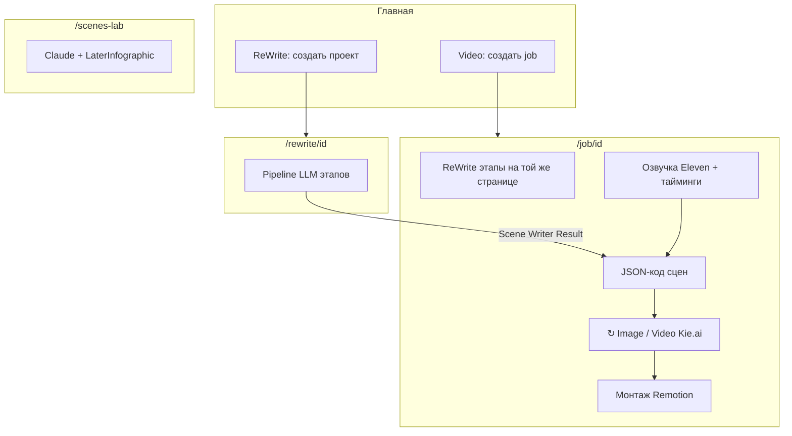
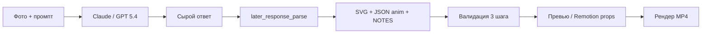

# JSON scripts for scene generation review
_Exported on 23.05.2026 at 1:47:05 GMT+3 from Cursor (3.5.17)_

---

**User**

@srv/json_video/1cursor_json_script_for_scene_generation.md @srv/json_video/2cursor_json_script_for_scene_generation.md @srv/json_video/3cursor_json_script_for_scene_generation.md @srv/json_video/4cursor_json_script_for_scene_generation.md @srv/json_video/5cursor_json_script_for_scene_generation.md @srv/json_video/6cursor_json_script_for_scene_generation.md @srv/json_video/7cursor_json_script_for_scene_generation.md @srv/json_video/8cursor_json_script_for_scene_generation.md @srv/json_video/9cursor_json_script_for_scene_generation.md @srv/json_video/10cursor_json_script_for_scene_generation.md @srv/json_video/11cursor_json_script_for_scene_generation.md @srv/json_video/12cursor_json_script_for_scene_generation.md @srv/json_video/14cursor_json_script_for_scene_generation.md @srv/json_video/15cursor_json_script_for_scene_generation.md @srv/json_video/16cursor_json_script_for_scene_generation.md @srv/json_video/17cursor_json_scripts_for_scene_generatio.md @srv/json_video/18cursor_json_scripts_for_scene_generatio.md @srv/json_video/19cursor_json_scripts_for_scene_generatio.md @srv/json_video/20cursor_json_scripts_for_scene_generatio.md @srv/json_video/21cursor_presence_inquiry.md @srv/json_video/22cursor_presence_inquiry.md @srv/json_video/23cursor_presence_inquiry.md @srv/json_video/24cursor_presence_inquiry.md @srv/json_video/25cursor_presence_inquiry.md @srv/json_video/26cursor_presence_inquiry.md @srv/json_video/27cursor_presence_inquiry.md @srv/json_video/28cursor_presence_inquiry.md @srv/json_video/29cursor_presence_inquiry.md @srv/json_video/30cursor_json_scripts_for_scene_generatio.md @srv/json_video/31cursor_json_scripts_for_scene_generatio.md @srv/json_video/32cursor_json_scripts_for_scene_generatio.md @srv/json_video/33cursor_json_scripts_for_scene_generatio.md @srv/json_video/34cursor_json_scripts_for_scene_generatio.md @srv/json_video/35cursor_json_scripts_for_scene_generatio.md @srv/json_video/36cursor_json_scripts_for_scene_generatio.md @srv/json_video/37cursor_json_scripts_for_scene_generatio.md @srv/json_video/38cursor_json_scripts_for_scene_generatio.md @srv/json_video/39cursor_json_scripts_for_scene_generatio.md @srv/json_video/40cursor_json_scripts_for_scene_generatio.md @srv/json_video/41cursor_json_scripts_for_scene_generatio.md @srv/json_video/42cursor_json_scripts_for_scene_generatio.md @srv/json_video/43cursor_json_scripts_for_scene_generatio.md @srv/json_video/44cursor_json_scripts_for_scene_generatio.md @srv/json_video/45cursor_json_scripts_for_scene_generatio.md @srv/json_video/46cursor_json_scripts_for_scene_generatio.md @srv/json_video/47cursor_json_scripts_for_scene_generatio.md @srv/json_video/48cursor_json_scripts_for_scene_generatio.md @srv/json_video/49cursor_json_scripts_for_scene_generatio.md @srv/json_video/50cursor_json_scripts_for_scene_generatio.md @srv/json_video/51cursor_json_scripts_for_scene_generatio.md @srv/json_video/52cursor_json_scripts_for_scene_generatio.md @srv/json_video/53cursor_json_scripts_for_scene_generatio.md @srv/json_video/54cursor_json_scripts_for_scene_generatio.md @srv/json_video/55cursor_json_scripts_for_scene_generatio.md @srv/json_video/56cursor_json_scripts_for_scene_generatio.md @srv/json_video/57cursor_json_scripts_for_scene_generatio.md @srv/json_video/58cursor_json_scripts_for_scene_generatio.md @srv/json_video/59cursor_json_scene_generation_files_over.md @srv/json_video/60cursor_json_scene_generation_files_over.md @srv/json_video/61cursor_json_scene_generation_files_over.md @srv/json_video/62cursor_json_scene_generation_files_over.md @srv/json_video/63cursor_json_scene_generation_files_over.md @/Users/philipp/Downloads/64cursor_json_scene_generation_files_over.md  Изучи подробно все файлы по очереди прям

---

**Cursor**

Изучаю все указанные файлы по порядку — начну с обзора структуры и первых документов.


Читаю файлы пакетами — извлекаю ключевые моменты из каждого.


Извлекаю все сообщения пользователя из каждого файла для хронологии.


Изучил **62 файла** в `/srv/json_video` (номера **1–12, 14–16, 17–58, 59–63**). Файла **13** в каталоге нет. **`64cursor_json_scene_generation_files_over.md`** на сервере отсутствует (путь `/Users/philipp/Downloads/…` — только у вас локально; если нужен разбор, положите его в `/srv/json_video`).

Ниже — сводка по хронологии и текущему состоянию проекта. Код не менял.

---

## Что это за файлы

Экспорты чатов Cursor: каждый следующий файл **накопительный** (внутри снова вся ранняя переписка + новые сообщения). Реальная «эволюция» — по **новым** запросам в конце цепочки; файлы **59–63** — уже сессии «войти в контекст» и доработки без полного переписывания истории.

---

## Фаза 1 — Запуск Video (файлы 1–6)

**Цель:** веб-приложение в `/srv/json_video` для сцен из JSON → картинки (Nano Banana через **Kie.ai**) и видео (Veo3).

| Элемент | Решение |
|--------|---------|
| Стек | Python **Flask**, Jinja2, CSS, vanilla JS |
| Формат JSON | Не массив, а **строки-объекты**; новая сцена по `scene_id` |
| Поля сцены | `text`, `start`/`end`/`video` с `prompt` (может быть `null`) |
| Первая страница | Парсинг, preview, Save Job → `data/jobs/` |
| UI | Aspect ratio 16:9 / 9:16, длительность 10/15 с, модели-заглушки |
| Инфра | Переименование `.json_video` → `json_video`, деплой **http://72.56.116.130:5000**, GitHub `cashdraft/json_video`, `.env` + `KEYAI_API_KEY` |

Дальше: редирект после Save Job на `/job/<id>`, список проектов на главной, **название проекта**.

---

## Фаза 2 — Генерация Kie.ai (файлы 7–9)

- Подробные **статусы** задач (отправлено, ожидание, таймер).
- **Отмена** генерации.
- **Лайтбокс** по картинкам/видео с листанием, подписи сцены Start/End, перегенерация.
- **Видео** только после готовых картинок; красная кнопка, пока картинки нет.
- Статусы **не сбрасываются** при F5 (сохранение в job).

---

## Фаза 3 — ReWrite Master (файлы 10–16, 17–20)

Второй продукт на том же Flask: **`/rewrite`** — конвейер LLM-этапов.

- Шаблоны в `rewrite_templates/<name>/` (Config, Hero, Master, Analysis…).
- **Duration** → `length_spec` в user/system.
- Этапы с lock/unlock (✎/✓), «Отправляем: …» по каждому блоку.
- **Analysis** только: Master, Analysis Prompt, Duration, Input text (без Hero).
- Добавлены **Persona Editor**, **Voiceover Editor**, **Structure Splitter** и др.
- Экспорт запросов в читаемый JSON (`text_lines`), автосохранение шаблона по ✓.

---

## Фаза 4 — Video как ReWrite + озвучка (файлы 21–29, 30–37)

- На главной только **создание проекта**; JSON/настройки/сцены — на **`/job/<id>`**.
- Блоки в стиле **«Озвучка ElevenLabs»** (сворачиваемые карточки).
- Кнопки **↻ Image**, **↻ ↻ Image**, **↻ Video**, batch-генерация, остановка.
- **ElevenLabs** + тайминги слов, **Whisper**, проверки, чанки 2–4.
- **Scene Writer** → подстановка в **JSON-код сцен**.
- **Remotion**: монтаж, zoom/fade, задача на сервере, статус при закрытии браузера.
- Удалены устаревшие блоки (Whisper-транскрибация отдельно, Continuity/Voice Flow, Pexels/Scene Writer Live и т.д.).

---

## Фаза 5 — Промпты, пресеты, макросы (файлы 38–47, 48–54)

- **Locked prompts** (`locked_prompt_files/`) + PIN (`LOCKED_PROMPTS_PIN`).
- Макросы: `{{LANGUAGE}}`, `{{DURATION}}`, `{{TARGET_CHARS}}`, `{{ORIGINAL_TITLE}}`, `{{MASTER_PROMT}}`, `{{HERO_PROMT}}`, позже `{{SCENE_LENGTH_RULES}}` и др.
- Пресеты (**«Я уже ЗАrewriteИЛ»** и др.) с жёсткой логикой «есть Result → ↻, иначе ✕».
- **Итоговый текст** = зеркало **Исходный текст** (Russian, Semantic только от итога).
- **Шаблоны изображений** (`image_templates/`), drag-and-drop, `Image_1`…`Image_7`, JPEG/WebP, long edge ≤2048.

---

## Фаза 6 — UI job-страницы (файлы 55–58, 59–61)

- Настройки в одну строку: Aspect Ratio, Resolution, Image/Video Model, шаблон изображений.
- Сцены: сворачивание по одной, **`scene_001 — 3.42 с`**, бейджи Start/End/Video (серый / зелёная рамка / зелёный текст).
- **JSON-код сцен**: один блок сверху; убран дубль над «Добавить сцены».
- **Тайминги Scenes** (как Eleven), связка **Scene Writer Result** → JSON.
- Проверка Scene Writer: **% совпадения**, ↻ перегенерация по блокам.
- Баги: пропадание озвучки после reload, сцены до «Добавить сцены», дефолты Model 5.4, Resolution 1K, Nano Banana 2.

---

## Фаза 7 — Scenes-lab + Remotion (файлы 62–63)

- **`/scenes-lab`**: Claude → валидация → **props.json** → композиция **LaterInfographic** (все типы anim: fade-in, fly-up, grow-x, count-up…).
- Рендер MP4, Studio :3000, превью на странице, скачивание через `Content-Disposition`.
- **Длина сцены / Стиль Image / Стиль Video** — кастомные dropdown как «Язык», макрос `{{SCENE_LENGTH_RULES}}`.
- Оптимизация аудио в Remotion Studio, статус монтажа внизу страницы.

---

## Текущая архитектура (как в переписке)



**Ключевые файлы:** `app.py`, `kie_client.py`, `rewrite_pipeline.py`, `templates/job.html`, `templates/_rewrite_block.html`, `static/style.css`, `remotion/`, `data/jobs/`, `data/rewrite_jobs/` (не в git).

**Секреты:** `KEYAI_API_KEY` / `KIE_API_KEY` в `.env`, сервис **`json-video`** (systemd).

---

## Открытые/недавние темы (из 59–63)

1. Синхронизация **Scene Writer → JSON-код сцен** (Result, радиокнопка Scene Writer).
2. Стабильность **озвучки и таймингов Eleven** после перезагрузки.
3. UI **Тайминги Scenes** над «Добавить сцены» без дублей полей.
4. **Scenes-lab / Remotion**: перезапуск сервисов, Studio, спиннер «Later…» после рендера.
5. Референсы изображений: переименование `Image_N`, JPEG, порядок в Kie.

---

## Практические заметки для работы со мной

- Все `.md` из корня вы просили **всегда пушить** на GitHub вместе с кодом.
- Частые просьбы: **перезапустить `json-video`**, **Ctrl+F5**, пуш с md и `locked_prompt_files`.
- Параллельно существовал **`json_video_test`** (Remotion job) — потом перенос в основной проект.

---

Файл **64** на этой машине недоступен. Если скопируете его в `/srv/json_video/`, могу дочитать и дополнить сводку. Если нужно продолжить разработку — напишите конкретную задачу (например, из списка «открытых тем» выше).

---

**User**

@srv/json_video/64cursor_json_scene_generation_files_over.md  держи его еще

---

**Cursor**

Файл **64** учтён — это продолжение после 63 (экспорт от **22.05.2026**). Ниже только то, что **добавляет** к уже разобранным 1–63.

---

## Файл 64 — краткая хронология (33 сообщения)

### Исправления в основном проекте (`/job`)

| Проблема | Решение |
|----------|---------|
| В ElevenLabs лишние **premade**-голоса | В списке только **клоны, Voice Design, saved/workspace** (`elevenlabs_client.py`, API v2) |
| **Failed to fetch** при генерации картинок | Убрана синхронизация шаблона из каждого автосейва; очередь PUT; **`fetchWithRetry`** на `/generate/start` |
| Видео: «Generate Start image first», хотя картинка видна | Гонка: клиент передаёт **`start_image_url` / `end_image_url`**, сервер сразу пишет в job |
| Remotion Studio: ошибка декодирования **MP3** (волна на таймлайне) | **`JobMontage`**: `showInTimeline={false}`; **`job_montage_prepare.py`**: перекод voiceover в stereo MP3 |

---

### Эволюция `/scenes-lab` (отдельная лаборатория)

1. **Сначала** — 10 случайных готовых сцен из `data/jobs` (витрина развёрнутой сцены).
2. **Потом** — только блок **Later…** (карточки сцен убраны).
3. **Статика** — фиксированный снимок:
   - `data/scenes_lab/snapshot.json`
   - медиа в `/static/scenes_lab/`
   - обновление: `python3 scenes_lab_snapshot.py`
   - страница **не** сканирует jobs при каждом открытии.

**Later… — пайплайн:**



| Компонент | Назначение |
|-----------|------------|
| `later_response_parse.py` | Маркеры `===SVG_START===` … или фенсы; снятие двойной обёртки; **авто-вставка `<text>`** |
| `later_anim_dictionary.py` | **Один источник** словаря anim → промпт + валидатор |
| `CANONICAL_ALLOWED` (9) | `none`, `fade-in`, `fade-out`, `fly-up`, `grow-y`, `grow-x`, `scale-in`, `draw-path`, `count-up` |
| `data/scenes_lab/later_session.json` | Сохранение ответа при F5; очистка при новой отправке |
| `remotion/LaterInfographic` | Все типы anim, **props.json**, рендер, Studio :3000, превью MP4, скачивание через `attachment` |
| Модели | Claude Opus/Sonnet (Kie) + **ChatGPT 5.4** (`OPENAI_API_KEY`) |

**UI Later… (финал в 64):**
- Редактируемое поле **«Ответ модели (целиком)»** + **«Проверить и собрать»** (Ctrl+Enter)
- Статус с **секундами**
- Сырой ответ **над** ошибками
- Блок **«Правка фрагмента SVG (модель)»**: system prompt + фрагмент `===SVG_START/END===` + **PNG 1920×1080** → модель возвращает только кусок SVG → подстановка в полный ответ
- Превью PNG: фикс **width/height** на корне `<svg>` (без растягивания 100×100)

**Git (ветка `new`):**
- Коммиты scenes-lab, LaterInfographic, `static/scenes_lab/`, `snapshot.json`
- В репо **не** уходят: `later_session.json`, `data/scenes_lab/remotion/`, uploads

---

## Полная картина 1–64

| Область | Где живёт |
|---------|-----------|
| Продакшен Video + ReWrite | `http://72.56.116.130:5000` → `/job`, `/rewrite` |
| Лаборатория motion/SVG | `http://72.56.116.130:5000/scenes-lab` |
| Remotion Studio (lab) | `:3000/LaterInfographic?lab=1` |
| Remotion Studio (job) | `JobMontage?job=…` (аудио без волны на таймлайне) |

**Ключевые новые файлы из 64:**  
`scenes_lab_later.py`, `later_response_parse.py`, `later_anim_dictionary.py`, `scenes_lab_svg_patch.py`, `scenes_lab_remotion.py`, `scenes_lab_snapshot.py`, `claude_kie.py`, `static/scenes_lab.js`, `remotion/src/LaterInfographic/`.

---

Контекст **1–64** у меня в голове. Могу продолжить с любой задачей — основной проект, scenes-lab или стыковка lab → job.

---

**User**

Так реализуй на сервере так сказать дампы, собирай раз в сутки весь проект json_video в архив и клади в какую то папку

---

**Cursor**

Реализую ежедневные дампы проекта: сначала посмотрю структуру и что уже есть на сервере.


Проект ~21 ГБ; настрою ежедневный архив в `/srv/backups/json_video/` с ротацией, чтобы не забить диск.


---

**User**

Так реализуй на сервере так сказать дампы, собирай раз в сутки весь проект json_video в архив и клади в какую то папкуРеализую ежедневные дампы проекта: сначала посмотрю структуру и что уже есть на сервере.


/var/spool/cron/crontabs/:
total 8
drwx-wx--T 2 root crontab 4096 Mar 31  2024 .
drwxr-xr-x 3 root root    4096 Dec  6 12:51 ..
160K	/srv/json_video/locked_prompt_files/
28K	/srv/json_video/scripts/
20K	/srv/json_video/tests/
8.0K	/srv/json_video/docs/
8.0K	/srv/json_video/deploy/
1.1M	/srv/json_video/data/scenes_lab/
20K	/srv/json_video/data/secrets/
4.0K	/srv/json_video/data/logs/
4.0K	/srv/json_video/data/job_pexels/
4.0K	/srv/json_video/data/input/
Проект ~21 ГБ; настрою ежедневный архив в /srv/backups/json_video/ с ротацией, чтобы не забить диск.

#!/usr/bin/env bash
# Ежедневный дамп проекта json_video → /srv/backups/json_video/
# Запуск: вручную или через /etc/cron.d/json-video-backup (03:30)
# Ежедневный дамп /srv/json_video → /srv/backups/json_video/
# Лог: /srv/backups/json_video/backup.log
SHELL=/bin/bash
PATH=/usr/local/sbin:/usr/local/bin:/sbin:/bin:/usr/sbin:/usr/bin -- давай делапй но все без срендериных видео 

---

**Cursor**

Делаю ежедневный дамп в `/srv/backups/json_video/` без срендеренных видео.


Обновляю скрипт: исключаю все `.mp4` и каталоги с рендерами, затем проверю дамп.


Готово: ежедневные дампы настроены **без срендеренных видео**.

## Как работает

| Что | Где |
|-----|-----|
| Скрипт | `/srv/json_video/scripts/backup_daily.sh` |
| Архивы | `/srv/backups/json_video/json_video_YYYYMMDD_HHMMSS.tar.gz` |
| Последний дамп | `/srv/backups/json_video/latest.tar.gz` (симлинк) |
| Лог | `/srv/backups/json_video/backup.log` |
| Cron | **каждый день в 03:30** — `/etc/cron.d/json-video-backup` |

## Что **не** попадает в архив

- Все **`*.mp4`** (монтаж, scenes-lab, копии в `job_remotion`)
- `data/job_videos/`
- `data/job_remotion/` (целиком — там в основном рендер и копии под Remotion)
- `data/scenes_lab/remotion/`
- `remotion/out/`, `remotion/scene_renders/`
- `remotion/node_modules/`, кэши, `__pycache__`
- `.venv/` (по умолчанию; восстановление: `python3 -m venv .venv && pip install -r requirements.txt`)

В архиве остаются: код, `data/jobs/`, `data/rewrite_jobs/`, озвучка, шаблоны, `.env`, картинки сцен и т.д.

## Проверка

Первый дамп уже создан: **~405 МБ** (вместо ~21 ГБ с рендерами). В архиве нет `.mp4` и `job_remotion`.

**Ротация:** хранятся архивы за **7 дней** (переменная `JSON_VIDEO_BACKUP_RETENTION_DAYS`).

## Ручной запуск

```bash
/srv/json_video/scripts/backup_daily.sh
```

С venv в архиве (редко нужно):

```bash
JSON_VIDEO_BACKUP_INCLUDE_VENV=1 /srv/json_video/scripts/backup_daily.sh
```

---

**User**

Так теперь по странице 1 - Описание сцены: Человек летит на луну и надпись Луна-Близко
и Хронометраж: 5,4 - выносим в отдельные строки для ввода текста а в промт будем вставлять переменной 2- блок ввода промта сделай как у нас на всем проекте разворачиваемый по кнопке редактировать и назови его svg промт 

---

**Cursor**

Просматриваю текущую реализацию scenes-lab и паттерн «редактировать» в проекте.


Добавляю поля «Описание сцены» и «Хронометраж», шаблон svg промта с переменными и блок с кнопкой ✎/✓.


Готово на `/scenes-lab`.

## Что изменилось

### 1. Отдельные поля ввода
- **Описание сцены** — однострочное поле
- **Хронометраж (сек)** — однострочное поле (можно `5,4` или `5.4`)

При отправке в промт подставляются переменные:
- `{{SCENE_DESCRIPTION}}`
- `{{SCENE_DURATION_SEC}}`

### 2. Блок **svg промт**
- Как в ReWrite: по умолчанию **заблокирован** (readonly)
- Кнопка **✎** — редактирование
- **✓** — снова закрыть (без автосохранения на сервер, только локально до «Отправить»)
- В шаблоне остаются плейсхолдеры вместо жёстко вписанных строк

### 3. Сессия и API
- В `later_session.json` сохраняются `svg_prompt`, `scene_description`, `scene_duration_sec`
- Старые сессии с одним большим `user_prompt` при загрузке **разбираются** автоматически

**Файлы:** `scenes_lab_later.py`, `scenes_lab_session.py`, `templates/scenes_lab.html`, `static/scenes_lab.js`, `static/scenes_lab.css`, `app.py`

Сервис перезапущен. Обновите страницу (**Ctrl+Shift+R**).

---

**User**

1 - дальше будут идти кнопка Отправить, после нее небольшой лог затем ответ от модели и под этим Проверить и собрать и выводим только SVG срендереную картинку 2- svg промт сделай сворачиваемым разворачиваемым

---

**Cursor**

Перестраиваю layout страницы scenes-lab: сворачиваемый svg промт, порядок блоков и только превью SVG.


Перестраиваю HTML, CSS и JS.


Проверяю текущее состояние файлов и завершаю правки.


Добавляю отсутствующую функцию `bindSvgPromptCollapse`, стили и доработки отображения результата.


Готово: интерфейс **Later…** на `/scenes-lab` приведён к вашему порядку.

### Порядок блоков
1. **Описание сцены** и **Хронометраж**
2. **svg промт** — сворачиваемый блок (по умолчанию свёрнут)
3. Прикрепить фото
4. **Отправить**
5. **Лог** (компактный, с метками времени)
6. **Ответ модели (целиком)**
7. **Проверить и собрать** (под ответом; Ctrl+Enter тоже работает)
8. **Только картинка** — отрендеренный SVG 1920×1080; при успешной валидации баннер скрыт, при ошибке — текст ошибки над превью

### svg промт
- Клик по заголовку с шевроном — свернуть/развернуть
- **✎** — разблокировать редактирование и автоматически развернуть блок
- **✓** — снова заблокировать

### Технически
- Исправлена ошибка: вызывался `bindSvgPromptCollapse`, но функции не было
- Старые вкладки SVG/Анимация/Пояснение убраны из основного UI; данные для Remotion остаются в скрытом блоке
- Сервис `json-video` перезапущен

Обновите страницу жёстко: **Ctrl+Shift+R**. Если что-то визуально не так — напишите, подправим.

---

**User**

ну ты все остальные блоки я надеюсь просто закоментил и рендер и т.д.?

---

**Cursor**

Проверяю, что именно сделано с блоками Remotion и остальными — скрыты, закомментированы или удалены.


Нет — в шаблоне **ничего не закомментировано** через `<!-- ... -->`. Сделано так:

### Что убрано из разметки (не закомментировано)
Старый пайплайн с вкладками **SVG / Анимация / Пояснение** и подписью «Превью кадра 1920×1080» из `scenes_lab.html` **удалён**, а не спрятан в комментариях. Восстановить можно только из git/бэкапа.

### Что осталось в DOM, но скрыто
| Блок | Как скрыт | Когда виден |
|------|-----------|-------------|
| **SVG / JSON / notes** (textarea) | `later-lab__internals` + `display: none` | Никогда на экране — нужны JS и Remotion |
| **SVG patch** | внутри `internals`, `hidden` | Только если снова подключить UI patch |
| **Старый статус** (таймер, спиннер) | `is-hidden` + `aria-hidden` | Почти не используется; основной вывод — **лог** |
| **Remotion** (props, рендер MP4, Studio, видео) | `later-remotion is-hidden` | **Показывается после успешной валидации** — `setRemotionPanelVisible(wrap, true)` в JS |

То есть **рендер MP4 и Remotion не выкинуты**: логика в `scenes_lab.js` на месте, панель появляется под превью SVG, когда валидация OK.

### Что видно по вашему ТЗ
Только основной поток: промт → Отправить → лог → ответ → Проверить и собрать → **картинка SVG** (+ при OK снизу может всплыть Remotion).

Если нужно, чтобы **Remotion и рендер вообще не показывались** на этой странице (только SVG, всё остальное «в запасе» в скрытом блоке или в комментариях) — напишите, сделаю: либо всегда `is-hidden`, либо отдельная сворачиваемая секция «Дополнительно», либо верну старые вкладки в свёрнутом виде.

---

**User**

ты что после правки моего промта не перезаписал его на сервер? svg промт

---

**Cursor**

Проверяю, как сохраняется svg промт на сервере при редактировании.


Проблема: правка svg промта в UI не сохраняется на сервер — только при «Отправить»/«Проверить». Кнопка ✓ лишь блокирует поле. Добавляю сохранение на сервер и подстановку сохранённого промта при загрузке страницы.


Да, вы правы: **раньше правка svg промта на сервер не попадала**.

### Как было
- Промт в textarea — только в браузере.
- Кнопка **✓** только закрывала редактирование, **без запроса на сервер**.
- На диск (`later_session.json`) промт писался **только** при **Отправить** или **Проверить и собрать**.
- При открытии страницы подставлялся шаблон из кода `DEFAULT_LATER_SVG_USER_TEMPLATE` в `scenes_lab_later.py`, а не ваш отредактированный текст (если вы не делали отправку после правки).

В `later_session.json` сейчас лежит старый шаблон с `{{SCENE_DESCRIPTION}}` — это как раз сохранение с последней отправки, не отдельный «ваш» файл промта.

### Что сделано сейчас
1. **`data/scenes_lab/later_prefs.json`** — отдельное хранилище полей формы (svg промт, описание, хронометраж, модель, фото).
2. **`POST /scenes-lab/api/prefs`** — сохранение без запроса к модели.
3. При **✓** (закрыли редактирование) — промт **сразу пишется на сервер**, в лог: «svg промт сохранён на сервере».
4. При загрузке `/scenes-lab` — в поле подставляется **сохранённый** промт (сессия → prefs → дефолт из кода).
5. При **Отправить** / **Проверить** prefs тоже обновляются.

### Что сделать вам
1. **Ctrl+Shift+R** на странице.
2. **✎** → правите промт → **✓** (дождитесь строки в логе про сохранение).
3. Обновите страницу — должен остаться **ваш** текст.

Если правили промт **до этого фикса** и не нажимали Отправить — тот текст на сервере не был; его нужно ввести ещё раз и сохранить через **✓**. Если пришлёте нужный текст, могу записать его в `later_prefs.json` вручную.

---

**User**

пока не делай проверку на анимацию пока мы будем получать только вот такой ответ модели ===SVG_START===
<svg xmlns="http://www.w3.org/2000/svg" viewBox="0 0 1920 1080">
  <defs>
    <radialGradient id="bgGlowLeft" cx="38%" cy="52%" r="52%">
      <stop offset="0%" stop-color="#17345f" stop-opacity="0.95"/>
      <stop offset="55%" stop-color="#0b1630" stop-opacity="0.55"/>
      <stop offset="100%" stop-color="#03050d" stop-opacity="0"/>
    </radialGradient>
    <radialGradient id="bgGlowRight" cx="72%" cy="50%" r="46%">
      <stop offset="0%" stop-color="#4a235f" stop-opacity="0.78"/>
      <stop offset="60%" stop-color="#1a1230" stop-opacity="0.38"/>
      <stop offset="100%" stop-color="#03050d" stop-opacity="0"/>
    </radialGradient>
    <linearGradient id="panelStroke" x1="0" y1="0" x2="1" y2="1">
      <stop offset="0%" stop-color="#ffffff" stop-opacity="0.18"/>
      <stop offset="100%" stop-color="#ffffff" stop-opacity="0.05"/>
    </linearGradient>
    <linearGradient id="gamingBar" x1="0" y1="0" x2="1" y2="0">
      <stop offset="0%" stop-color="#7fd6ff"/>
      <stop offset="100%" stop-color="#b58cff"/>
    </linearGradient>
    <linearGradient id="renderBar" x1="0" y1="0" x2="1" y2="0">
      <stop offset="0%" stop-color="#8aa8ff"/>
      <stop offset="100%" stop-color="#d08cff"/>
    </linearGradient>
    <linearGradient id="aiBar" x1="0" y1="0" x2="1" y2="0">
      <stop offset="0%" stop-color="#9ce7ff"/>
      <stop offset="100%" stop-color="#ff8ccf"/>
    </linearGradient>
    <filter id="softGlow" x="-30%" y="-30%" width="160%" height="160%">
      <feGaussianBlur stdDeviation="18" result="blur"/>
      <feMerge>
        <feMergeNode in="blur"/>
        <feMergeNode in="SourceGraphic"/>
      </feMerge>
    </filter>
  </defs>

  <g id="layer-bg">
    <rect id="bg-base" x="0" y="0" width="1920" height="1080" fill="#03050d"/>
    <rect id="bg-glow-left" x="0" y="0" width="1920" height="1080" fill="url(#bgGlowLeft)"/>
    <rect id="bg-glow-right" x="0" y="0" width="1920" height="1080" fill="url(#bgGlowRight)"/>
  </g>

  <g id="layer-stars" fill="#ffffff">
    <circle id="star-1" cx="90" cy="170" r="1.2" opacity="0.72"/>
    <circle id="star-2" cx="210" cy="78" r="1.8" opacity="0.68"/>
    <circle id="star-3" cx="355" cy="215" r="1.4" opacity="0.58"/>
    <circle id="star-4" cx="465" cy="92" r="2.2" opacity="0.86"/>
    <circle id="star-5" cx="628" cy="140" r="1.3" opacity="0.55"/>
    <circle id="star-6" cx="812" cy="76" r="1.5" opacity="0.72"/>
    <circle id="star-7" cx="1048" cy="155" r="1.1" opacity="0.48"/>
    <circle id="star-8" cx="1138" cy="92" r="2.1" opacity="0.82"/>
    <circle id="star-9" cx="1320" cy="108" r="1.7" opacity="0.7"/>
    <circle id="star-10" cx="1518" cy="168" r="2.4" opacity="0.8"/>
    <circle id="star-11" cx="1628" cy="76" r="1.5" opacity="0.62"/>
    <circle id="star-12" cx="1812" cy="124" r="1.1" opacity="0.52"/>
    <circle id="star-13" cx="166" cy="390" r="1.4" opacity="0.56"/>
    <circle id="star-14" cx="720" cy="330" r="2.8" opacity="0.9"/>
    <circle id="star-15" cx="1230" cy="268" r="1.3" opacity="0.62"/>
    <circle id="star-16" cx="1430" cy="375" r="1.3" opacity="0.54"/>
    <circle id="star-17" cx="1730" cy="268" r="1.9" opacity="0.72"/>
    <circle id="star-18" cx="1868" cy="420" r="1.5" opacity="0.58"/>
    <circle id="star-19" cx="120" cy="646" r="1.1" opacity="0.5"/>
    <circle id="star-20" cx="286" cy="510" r="2.0" opacity="0.74"/>
    <circle id="star-21" cx="584" cy="600" r="1.4" opacity="0.52"/>
    <circle id="star-22" cx="1682" cy="480" r="1.8" opacity="0.7"/>
    <circle id="star-23" cx="1790" cy="628" r="1.2" opacity="0.48"/>
    <circle id="star-24" cx="410" cy="750" r="2.0" opacity="0.82"/>
    <circle id="star-25" cx="1448" cy="840" r="1.1" opacity="0.62"/>
    <circle id="star-26" cx="1578" cy="720" r="2.1" opacity="0.88"/>
    <circle id="star-27" cx="1064" cy="930" r="1.3" opacity="0.54"/>
    <circle id="star-28" cx="1760" cy="902" r="1.2" opacity="0.56"/>
    <circle id="star-29" cx="1882" cy="948" r="1.9" opacity="0.76"/>
    <circle id="star-30" cx="498" cy="1002" r="1.7" opacity="0.72"/>
    <circle id="star-31" cx="902" cy="1000" r="1.8" opacity="0.82"/>
    <circle id="star-32" cx="1228" cy="998" r="1.6" opacity="0.7"/>
    <circle id="star-33" cx="1488" cy="970" r="1.4" opacity="0.58"/>
    <circle id="star-34" cx="200" cy="960" r="1.2" opacity="0.5"/>
  </g>

  <g id="layer-panels">
    <rect id="panel-main" x="80" y="80" width="1760" height="920" rx="34" fill="#0a1020" fill-opacity="0.34" stroke="url(#panelStroke)" stroke-width="1.5"/>
    <rect id="panel-left" x="110" y="170" width="760" height="760" rx="28" fill="#0f172b" fill-opacity="0.42" stroke="#ffffff" stroke-opacity="0.08" stroke-width="1.2"/>
    <rect id="panel-right-top" x="930" y="170" width="880" height="360" rx="28" fill="#11182d" fill-opacity="0.42" stroke="#ffffff" stroke-opacity="0.08" stroke-width="1.2"/>
    <rect id="panel-right-bottom" x="930" y="560" width="880" height="370" rx="28" fill="#11182d" fill-opacity="0.42" stroke="#ffffff" stroke-opacity="0.08" stroke-width="1.2"/>
  </g>

  <g id="layer-text" font-family="Arial, Helvetica, sans-serif" fill="#f7f7f5">
    <g id="word-title">
      <text id="t-word-title" x="110" y="132" font-size="92" font-weight="700" letter-spacing="8">RTX 4090 LOADOUT</text>
    </g>
    <g id="word-subtitle">
      <text id="t-word-subtitle" x="114" y="164" font-size="24" font-weight="400" letter-spacing="7" fill="#b8c0d4">WORKLOAD COMPARISON / SYSTEM TELEMETRY</text>
    </g>

    <g id="word-left-header">
      <text id="t-word-left-header" x="150" y="230" font-size="28" font-weight="700" letter-spacing="4" fill="#dce4f5">WORKLOAD SNAPSHOT</text>
    </g>

    <g id="word-gaming-label">
      <text id="t-word-gaming-label" x="150" y="300" font-size="34" font-weight="700" letter-spacing="2">GAMING</text>
    </g>
    <g id="word-gaming-gpu">
      <text id="t-word-gaming-gpu" x="150" y="350" font-size="24" fill="#cfd7e8">GPU</text>
    </g>
    <g id="word-gaming-gpu-val">
      <text id="t-word-gaming-gpu-val" x="760" y="350" font-size="24" text-anchor="end" fill="#ffffff">96%</text>
    </g>
    <g id="word-gaming-cpu">
      <text id="t-word-gaming-cpu" x="150" y="402" font-size="24" fill="#cfd7e8">CPU</text>
    </g>
    <g id="word-gaming-cpu-val">
      <text id="t-word-gaming-cpu-val" x="760" y="402" font-size="24" text-anchor="end" fill="#ffffff">34%</text>
    </g>
    <g id="word-gaming-vram">
      <text id="t-word-gaming-vram" x="150" y="454" font-size="24" fill="#cfd7e8">VRAM</text>
    </g>
    <g id="word-gaming-vram-val">
      <text id="t-word-gaming-vram-val" x="760" y="454" font-size="24" text-anchor="end" fill="#ffffff">18.2 GB</text>
    </g>
    <g id="word-gaming-temp">
      <text id="t-word-gaming-temp" x="150" y="506" font-size="24" fill="#cfd7e8">TEMP</text>
    </g>
    <g id="word-gaming-temp-val">
      <text id="t-word-gaming-temp-val" x="760" y="506" font-size="24" text-anchor="end" fill="#ffffff">74°C</text>
    </g>
    <g id="word-gaming-fps">
      <text id="t-word-gaming-fps" x="150" y="558" font-size="24" fill="#cfd7e8">FPS</text>
    </g>
    <g id="word-gaming-fps-val">
      <text id="t-word-gaming-fps-val" x="760" y="558" font-size="24" text-anchor="end" fill="#ffffff">142</text>
    </g>

    <g id="word-render-label">
      <text id="t-word-render-label" x="150" y="660" font-size="34" font-weight="700" letter-spacing="2">VIDEO RENDER</text>
    </g>
    <g id="word-render-gpu">
      <text id="t-word-render-gpu" x="150" y="710" font-size="24" fill="#cfd7e8">GPU</text>
    </g>
    <g id="word-render-gpu-val">
      <text id="t-word-render-gpu-val" x="760" y="710" font-size="24" text-anchor="end" fill="#ffffff">28%</text>
    </g>
    <g id="word-render-cpu">
      <text id="t-word-render-cpu" x="150" y="762" font-size="24" fill="#cfd7e8">CPU</text>
    </g>
    <g id="word-render-cpu-val">
      <text id="t-word-render-cpu-val" x="760" y="762" font-size="24" text-anchor="end" fill="#ffffff">91%</text>
    </g>
    <g id="word-render-ram">
      <text id="t-word-render-ram" x="150" y="814" font-size="24" fill="#cfd7e8">RAM</text>
    </g>
    <g id="word-render-ram-val">
      <text id="t-word-render-ram-val" x="760" y="814" font-size="24" text-anchor="end" fill="#ffffff">48 GB</text>
    </g>
    <g id="word-render-export">
      <text id="t-word-render-export" x="150" y="866" font-size="24" fill="#cfd7e8">EXPORT TIME</text>
    </g>
    <g id="word-render-export-val">
      <text id="t-word-render-export-val" x="760" y="866" font-size="24" text-anchor="end" fill="#ffffff">12m 42s</text>
    </g>

    <g id="word-right-header">
      <text id="t-word-right-header" x="970" y="230" font-size="28" font-weight="700" letter-spacing="4" fill="#dce4f5">AI TRAINING / POWER STATE</text>
    </g>
    <g id="word-ai-label">
      <text id="t-word-ai-label" x="970" y="300" font-size="34" font-weight="700" letter-spacing="2">AI TRAINING</text>
    </g>
    <g id="word-ai-gpu">
      <text id="t-word-ai-gpu" x="970" y="350" font-size="24" fill="#cfd7e8">GPU</text>
    </g>
    <g id="word-ai-gpu-val">
      <text id="t-word-ai-gpu-val" x="1710" y="350" font-size="24" text-anchor="end" fill="#ffffff">100%</text>
    </g>
    <g id="word-ai-vram">
      <text id="t-word-ai-vram" x="970" y="402" font-size="24" fill="#cfd7e8">VRAM</text>
    </g>
    <g id="word-ai-vram-val">
      <text id="t-word-ai-vram-val" x="1710" y="402" font-size="24" text-anchor="end" fill="#ffffff">FULL</text>
    </g>
    <g id="word-ai-power">
      <text id="t-word-ai-power" x="970" y="454" font-size="24" fill="#cfd7e8">POWER DRAW</text>
    </g>
    <g id="word-ai-power-val">
      <text id="t-word-ai-power-val" x="1710" y="454" font-size="24" text-anchor="end" fill="#ffffff">428W</text>
    </g>
    <g id="word-ai-cuda">
      <text id="t-word-ai-cuda" x="970" y="506" font-size="24" fill="#cfd7e8">CUDA CORES</text>
    </g>
    <g id="word-ai-cuda-val">
      <text id="t-word-ai-cuda-val" x="1710" y="506" font-size="24" text-anchor="end" fill="#ffffff">ACTIVE</text>
    </g>

    <g id="word-alert-header">
      <text id="t-word-alert-header" x="970" y="620" font-size="28" font-weight="700" letter-spacing="4" fill="#dce4f5">SYSTEM ALERTS</text>
    </g>
    <g id="word-alert-1">
      <text id="t-word-alert-1" x="1010" y="700" font-size="30" font-weight="700" fill="#ffb8d8">POWER SPIKE DETECTED</text>
    </g>
    <g id="word-alert-2">
      <text id="t-word-alert-2" x="1010" y="760" font-size="30" font-weight="700" fill="#ffd7e8">THERMAL LIMIT APPROACHING</text>
    </g>
    <g id="word-alert-3">
      <text id="t-word-alert-3" x="1010" y="820" font-size="30" font-weight="700" fill="#ffffff">SYSTEM BOTTLENECK: CPU</text>
    </g>

    <g id="word-footer-left">
      <text id="t-word-footer-left" x="970" y="900" font-size="22" fill="#cfd7e8" letter-spacing="1.5">BACKGROUND PROCESSES: 147</text>
    </g>
    <g id="word-footer-right">
      <text id="t-word-footer-right" x="1710" y="900" font-size="22" text-anchor="end" fill="#cfd7e8" letter-spacing="1.5">COOLING EFFICIENCY: 63%</text>
    </g>
  </g>

  <g id="layer-chart">
    <g id="chart-gaming">
      <rect id="bar-gaming-track" x="300" y="328" width="400" height="14" rx="7" fill="#ffffff" fill-opacity="0.08"/>
      <rect id="bar-gaming-gpu" x="300" y="328" width="384" height="14" rx="7" fill="url(#gamingBar)"/>
      <rect id="bar-gaming-cpu-track" x="300" y="380" width="400" height="14" rx="7" fill="#ffffff" fill-opacity="0.08"/>
      <rect id="bar-gaming-cpu" x="300" y="380" width="136" height="14" rx="7" fill="#8aa8ff"/>
      <rect id="bar-gaming-vram-track" x="300" y="432" width="400" height="14" rx="7" fill="#ffffff" fill-opacity="0.08"/>
      <rect id="bar-gaming-vram" x="300" y="432" width="291" height="14" rx="7" fill="#b58cff"/>
      <rect id="bar-gaming-temp-track" x="300" y="484" width="400" height="14" rx="7" fill="#ffffff" fill-opacity="0.08"/>
      <rect id="bar-gaming-temp" x="300" y="484" width="296" height="14" rx="7" fill="#9cc8ff"/>
      <rect id="bar-gaming-fps-track" x="300" y="536" width="400" height="14" rx="7" fill="#ffffff" fill-opacity="0.08"/>
      <rect id="bar-gaming-fps" x="300" y="536" width="355" height="14" rx="7" fill="#7fd6ff"/>
    </g>

    <g id="chart-render">
      <rect id="bar-render-gpu-track" x="300" y="688" width="400" height="14" rx="7" fill="#ffffff" fill-opacity="0.08"/>
      <rect id="bar-render-gpu" x="300" y="688" width="112" height="14" rx="7" fill="#8aa8ff"/>
      <rect id="bar-render-cpu-track" x="300" y="740" width="400" height="14" rx="7" fill="#ffffff" fill-opacity="0.08"/>
      <rect id="bar-render-cpu" x="300" y="740" width="364" height="14" rx="7" fill="url(#renderBar)"/>
      <rect id="bar-render-ram-track" x="300" y="792" width="400" height="14" rx="7" fill="#ffffff" fill-opacity="0.08"/>
      <rect id="bar-render-ram" x="300" y="792" width="300" height="14" rx="7" fill="#b58cff"/>
      <rect id="bar-render-export-track" x="300" y="844" width="400" height="14" rx="7" fill="#ffffff" fill-opacity="0.08"/>
      <rect id="bar-render-export" x="300" y="844" width="254" height="14" rx="7" fill="#9cc8ff"/>
    </g>

    <g id="chart-ai">
      <rect id="bar-ai-gpu-track" x="1120" y="328" width="500" height="14" rx="7" fill="#ffffff" fill-opacity="0.08"/>
      <rect id="bar-ai-gpu" x="1120" y="328" width="500" height="14" rx="7" fill="url(#aiBar)"/>
      <rect id="bar-ai-vram-track" x="1120" y="380" width="500" height="14" rx="7" fill="#ffffff" fill-opacity="0.08"/>
      <rect id="bar-ai-vram" x="1120" y="380" width="500" height="14" rx="7" fill="#ff8ccf"/>
      <rect id="bar-ai-power-track" x="1120" y="432" width="500" height="14" rx="7" fill="#ffffff" fill-opacity="0.08"/>
      <rect id="bar-ai-power" x="1120" y="432" width="476" height="14" rx="7" fill="#b58cff"/>
      <rect id="bar-ai-cuda-track" x="1120" y="484" width="500" height="14" rx="7" fill="#ffffff" fill-opacity="0.08"/>
      <rect id="bar-ai-cuda" x="1120" y="484" width="500" height="14" rx="7" fill="#9ce7ff"/>
    </g>

    <g id="chart-rings" filter="url(#softGlow)">
      <circle id="ring-outer" cx="1650" cy="700" r="92" fill="none" stroke="#ff8ccf" stroke-opacity="0.22" stroke-width="18"/>
      <circle id="ring-mid" cx="1650" cy="700" r="66" fill="none" stroke="#b58cff" stroke-opacity="0.28" stroke-width="14"/>
      <circle id="ring-inner" cx="1650" cy="700" r="40" fill="none" stroke="#7fd6ff" stroke-opacity="0.34" stroke-width="10"/>
      <circle id="dot-core" cx="1650" cy="700" r="10" fill="#ffffff" fill-opacity="0.9"/>
    </g>

    <g id="chart-alert-icons">
      <circle id="icon-alert-1" cx="980" cy="690" r="10" fill="#ff8ccf"/>
      <circle id="icon-alert-2" cx="980" cy="750" r="10" fill="#ffc0dd"/>
      <circle id="icon-alert-3" cx="980" cy="810" r="10" fill="#ffffff"/>
    </g>
  </g>
</svg>
===SVG_END===
===NOTES_START===
Слои и id:
- layer-bg: bg-base, bg-glow-left, bg-glow-right
- layer-stars: star-1 ... star-34
- layer-panels: panel-main, panel-left, panel-right-top, panel-right-bottom
- layer-text:
  word-title, word-subtitle, word-left-header,
  word-gaming-label, word-gaming-gpu, word-gaming-gpu-val, word-gaming-cpu, word-gaming-cpu-val, word-gaming-vram, word-gaming-vram-val, word-gaming-temp, word-gaming-temp-val, word-gaming-fps, word-gaming-fps-val,
  word-render-label, word-render-gpu, word-render-gpu-val, word-render-cpu, word-render-cpu-val, word-render-ram, word-render-ram-val, word-render-export, word-render-export-val,
  word-right-header, word-ai-label, word-ai-gpu, word-ai-gpu-val, word-ai-vram, word-ai-vram-val, word-ai-power, word-ai-power-val, word-ai-cuda, word-ai-cuda-val,
  word-alert-header, word-alert-1, word-alert-2, word-alert-3, word-footer-left, word-footer-right
- layer-chart:
  chart-gaming: bar-gaming-track, bar-gaming-gpu, bar-gaming-cpu-track, bar-gaming-cpu, bar-gaming-vram-track, bar-gaming-vram, bar-gaming-temp-track, bar-gaming-temp, bar-gaming-fps-track, bar-gaming-fps
  chart-render: bar-render-gpu-track, bar-render-gpu, bar-render-cpu-track, bar-render-cpu, bar-render-ram-track, bar-render-ram, bar-render-export-track, bar-render-export
  chart-ai: bar-ai-gpu-track, bar-ai-gpu, bar-ai-vram-track, bar-ai-vram, bar-ai-power-track, bar-ai-power, bar-ai-cuda-track, bar-ai-cuda
  chart-rings: ring-outer, ring-mid, ring-inner, dot-core
  chart-alert-icons: icon-alert-1, icon-alert-2, icon-alert-3

Выбранные фразы/цифры и почему:
- Заголовок “RTX 4090 LOADOUT” сделан крупным, в духе референса: массивный белый гротеск, широкий трекинг, космический тёмный фон с сине-фиолетовым свечением.
- Подзаголовок “WORKLOAD COMPARISON / SYSTEM TELEMETRY” задаёт техно-настроение и объясняет, что это сравнительная сцена.
- Слева собраны два сценария: GAMING и VIDEO RENDER. Это даёт чистую вертикальную структуру и не перегружает кадр.
- Справа вынесен AI TRAINING как самый экстремальный режим, плюс отдельный блок SYSTEM ALERTS для фраз:
  POWER SPIKE DETECTED,
  THERMAL LIMIT APPROACHING,
  SYSTEM BOTTLENECK: CPU.
  Они визуально важнее, поэтому крупнее и контрастнее.
- Background Processes: 147 и Cooling Efficiency: 63% поставлены внизу правого блока как вторичная телеметрия.
- Полосы нормированы визуально:
  96% = почти полный бар,
  34% = короткий бар,
  100% / FULL = полный бар,
  428W = почти максимум,
  18.2 GB и 48 GB показаны как относительные шкалы для читаемости, а не как абсолютные системные лимиты.
- Кольца справа внизу — декоративный техно-акцент в стиле референса: не перекрывают текст, поддерживают “cosmic scale” настроение, но уже адаптированы под GPU-telemetry тему.

BBox-проверка:
- Общая безопасная рамка: [80,80,1760,920], все элементы внутри, отступы от краёв соблюдены.
- Заголовочная зона: [110,80,1600,90]
- Подзаголовок: [114,140,760,30]
- Левый текстово-графический блок panel-left: [110,170,760,760]
- Правый верхний блок panel-right-top: [930,170,880,360]
- Правый нижний блок panel-right-bottom: [930,560,880,370]
- Декоративные кольца chart-rings: [1540,590,220,220]
- Alert icons зона: [970,680,20,140]

Подтверждение непересечения:
- Левая зона контента занимает x=110..870, правая зона контента занимает x=930..1810. Между ними постоянный зазор 60 px, прямого пересечения нет.
- Заголовок расположен выше панелей и не пересекается с ними по вертикали.
- Кольца справа внизу находятся внутри panel-right-bottom и смещены вправо; текст alert-блока расположен слева от них. Пересечения текста и иллюстрации нет.
- Все строки внутри левого и правого блоков имеют вертикальный шаг больше 1.4×font-size для своих групп.
- Ни один текст не наложен на декоративные звёзды критично: звёзды мелкие фоновые точки, не мешают читаемости.
===NOTES_END=== ----- по идее только ===SVG_START===
 н ===SVG_END=== нужен этот блок проверка по нему и работа по нему

---

**Cursor**

Ищу в коде проверку JSON анимации и сделаю её опциональной — достаточно блока SVG.


Сделано: **пустой JSON анимации больше не блокирует** «Проверить и собрать».

### Что изменилось
В `later_response_parse.py`:
- Если блока `===ANIM_START===` … `===ANIM_END===` **нет** — проверяется **только SVG** (XML, валидность тегов).
- В предупреждениях (не в ошибках): «JSON анимации нет — проверяется только блок ===SVG_START=== … ===SVG_END===».
- Если ANIM **есть** — старая проверка tracks/id/anim остаётся.

В UI:
- **Превью SVG** показывается при успешной валидации SVG.
- **Remotion** по-прежнему появляется только когда есть и валидный SVG, и JSON анимации (для SVG-only он скрыт).

### Ваш формат
Достаточно:
```
===SVG_START===
<svg>...</svg>
===SVG_END===
```
NOTES опциональны. ANIM пока не нужен.

Обновите страницу (**Ctrl+Shift+R**) и снова нажмите **Проверить и собрать** — должна появиться картинка без красной «JSON анимации пустой».

---

**User**

1 - Ответ модели (целиком)
сделай сворачиваемым - разворачиваемым 2- на сервре записывай куда-то можно просто в папку img_1 ===SVG_START===
<svg>...</svg>
===SVG_END=== - вот этот ответ уже поправленый нами и зарендереную картинку 3 - сделай картинке наверху надпись что это img_1  типа будут еще img_2 и img_3 и т.д. 4 - добавь на страницу около Проверить и собрать
редактор промт в таком же формате разворачиваем сворачиваем сохраняем на сервер и т.д. как 
svg промт

---

**Cursor**

Изучаю текущую разметку и API, чтобы добавить сворачиваемые блоки, сохранение в `img_1` и редактор промта.


Создаю модуль сохранения в `img_1`, API и обновляю UI.


Сделано по всем четырём пунктам.

### 1. «Ответ модели (целиком)» — сворачиваемый
Как у **svg промт**: шеврон + заголовок, по умолчанию **свёрнут**.

### 2. Сохранение на сервер в `img_1`
После успешного **Проверить и собрать** (или **Отправить** с валидным SVG) в папку:

`data/scenes_lab/img_1/`

| Файл | Содержимое |
|------|------------|
| `response.txt` | полный ответ с `===SVG_START===` … `===SVG_END===` |
| `scene.svg` | только SVG |
| `preview.png` | зарендеренный кадр 1920×1080 |
| `prompt.txt` | промт **img_1** (если задан) |
| `meta.json` | метаданные |

Раздача: `/scenes-lab/img-slots/img_1/preview.png` и т.д.

### 3. Подпись над картинкой
Над превью — метка **`img_1`** (позже можно добавить `img_2`, `img_3` — слоты уже по шаблону `img_N`).

Под картинкой — строка, что файлы лежат в `data/scenes_lab/img_1/`.

### 4. «промт img_1» у «Проверить и собрать»
Тот же UI, что **svg промт**: свёрнут / развёрнут, **✎ / ✓**, при **✓** — сохранение в `later_prefs.json` и `img_1/prompt.txt`.

---

**Ctrl+Shift+R** на `/scenes-lab`, затем **Проверить и собрать** — должны появиться подпись `img_1`, картинка и запись в `img_1/` на сервере.

---

**User**

1- промт img_1 переименуй в "промт редактор" 2 - около него добавь кнопку "переделать" по ней модели отправляется промт из промт редактор и картинка срендереная в Png  в нашем случае это img_1 в ответ мы получает опять вормат ===SVG_START===
<svg>...</svg>
===SVG_END=== и записываем ответ и картинку уже как img_2 ///// 3- так что перенеси промт
Ответ модели (целиком) лиже к самой картинки под ее название например и сделай возможность перелистывать вправа влево весь блок с картинкой при котором будет меняться вывод Ответ модели (целиком) и img_1 img_2 и т.д. //// при повторном нажатии переделать отправляется Ответ модели (целиком) и png рендер последней картинки которая есть у нас на сервере типа если есть img_1 и  img_2 то отправляем все данные только о img_2  ну и так далее

---

**Cursor**

Изучаю текущую реализацию слотов и API запросов к модели.


Реализую API «переделать», карусель слотов и новую вёрстку.


Сделано. Кратко по пунктам:

### 1. «промт img_1» → **промт редактор**
Переименован блок, сохранение в `later_prefs.json` и на сервер (поле `editor_prompt`).

### 2. Кнопка **Переделать**
Рядом с «промт редактор». Отправляет в модель:
- текст из **промт редактор**;
- **PNG последнего** слота на сервере (`img_2`, если есть `img_1` и `img_2`);
- **полный ответ** из `response.txt` этого же последнего слота.

Ответ парсится как SVG-only → сохраняется в **следующий** слот (`img_2`, `img_3`, …).

### 3. Карусель кадров
Под «Проверить и собрать»:
- **‹** `img_1` **›** — переключение слотов;
- превью PNG;
- под ним — сворачиваемый **Ответ модели (целиком)** для **текущего** слота.

При листании подгружаются `response.txt` и `preview.png` с сервера.

### 4. «Проверить и собрать»
Пишет в **текущий** слот карусели (или в `img_1`, если слотов ещё нет).

### Файлы на сервере
`data/scenes_lab/img_1/`, `img_2/`, … — в каждом: `response.txt`, `scene.svg`, `preview.png`, `prompt.txt`, `meta.json`.

Обновите страницу (**Ctrl+Shift+R**). Порядок: собрать `img_1` → заполнить **промт редактор** → **Переделать** → появится `img_2`, карусель переключит на него.

---

**User**

data/scenes_lab/img_1/, img_2/, … — в каждом: response.txt, scene.svg, preview.png, prompt.txt, meta.json.

---- prompt.txt,  - не нужен, промт 1 на все

---

**Cursor**

Убираю `prompt.txt` из слотов — один общий промт в `later_prefs`.


Готово: **`prompt.txt` в слотах больше не создаётся и не читается**.

В каждой папке `img_1/`, `img_2/`, … остаются только:
- `response.txt`
- `scene.svg`
- `preview.png`
- `meta.json`

**Промт редактор** один на все кадры — в `data/scenes_lab/later_prefs.json` (поле `editor_prompt`), сохраняется по **✓** в блоке «промт редактор».

Старые `prompt.txt` в уже существующих слотах можно удалить вручную — на работу не влияют.

---

**User**

не понятно, пошел запрос или нет к можели вообще

---

**Cursor**

Проверяю обработчик «Переделать» и улучшаю индикацию: явно покажем «отправка», «ожидание» и результат.


Добавляю явную строку статуса с таймером и пошаговый лог для «Переделать» и «Отправить».


Раньше было неочевидно: запрос **мог идти**, но интерфейс почти ничего не показывал — только две строки в логе в одну секунду, без таймера и без «ждём модель».

### Что добавлено (после **Ctrl+Shift+R**)

1. **Синяя полоска статуса** над логом — со спиннером и **счётчиком секунд**:
   - «Отправка на сервер…»
   - «Запрос к модели… (обычно 1–3 мин)»
   - «Готово — img_2» или текст ошибки

2. **Лог по шагам** для «Переделать»:
   - `→ POST /scenes-lab/api/remake`
   - `← ответ сервера: HTTP 200`
   - «Модель ответила — разбор SVG…»
   - «Готово: сохранено как img_2»

3. Кнопка **Переделать** на время запроса меняется на **«Переделать…»** и блокируется.

### Как понять, что идёт запрос
- Полоска **синяя + крутится + секунды растут** → запрос к модели в процессе (это нормально **1–3 минуты**).
- Появилась строка **`← ответ сервера: HTTP …`** → сервер уже ответил.
- **Красная** полоска + «Ошибка: …» в логе → запрос завершился с ошибкой.

Если после минуты полоска всё ещё «Запрос к модели…», а **`← ответ сервера`** нет — напишите, посмотрим логи сервера и таймаут API.

---

**User**

у меня долго листается от каринки к картинке, хочу чтоб быстро перелистываелись одна за ругой, в чем проблема может быть?

---

**Cursor**

Проверяю, что происходит при переключении слотов — вероятно, каждый раз идёт лишний запрос к серверу.


При переключении каждый раз заново качается PNG (из‑за `?v=timestamp`) и подтягивается огромный `response.txt`. Исправляю: мгновенное переключение превью из кэша и отложенная загрузка текста.


Вот в чём была проблема и что изменено.

### Почему было медленно
При каждом **‹ ›** происходило сразу несколько тяжёлых операций:
1. **Запрос к API** за полным слотом (`response.txt` + `scene.svg` — десятки/сотни КБ текста).
2. **PNG качался заново** — к URL каждый раз добавлялся `?v=текущее_время`, браузер не использовал кэш.
3. **Большой textarea** перезаписывался при каждом переключении (тормозит DOM).

### Что сделано
- **Картинка переключается сразу** — URL берётся из списка слотов, PNG **кэшируется** в браузере (стабильный `?v=saved_at`, без нового timestamp на каждый клик).
- **Предзагрузка** всех превью после загрузки страницы + соседних кадров при листании.
- **Текст ответа** подгружается отдельно и **только если** блок «Ответ модели» **развёрнут**; если свёрнут — листание только меняет картинку.
- Один `` переиспользуется (меняется только `src`), без пересборки всего блока.

**Ctrl+Shift+R** и попробуйте листать `img_1` ↔ `img_2` ↔ `img_3` — переключение должно быть почти мгновенным. Текст при первом развороте «Ответ модели» может подгрузиться с небольшой задержкой — это нормально.

---

**User**

вообще перестали листаться все 1 картинка и все хотя меняю и еще может выводить здесь не полный рендер а более легкую версию пнг

---

**Cursor**

Проверяю логику карусели и генерацию превью — ищу причину, почему листание перестало работать.


Исправляю залипание превью при пустом URL и добавляю лёгкий `preview_thumb.png` для UI.


Нашёл и исправил две вещи.

### Почему «листалось», но картинка одна
При переключении слота, если URL не подставлялся, код **выходил раньше** и **оставлял старый ``** — метка менялась (`img_3`), а PNG оставался от предыдущего кадра. Сейчас `src` **всегда обновляется**, при ошибке — fallback на `preview.png`.

### Лёгкое превью в UI
- В интерфейсе: **`preview_thumb.png` 960×540** (~300 КБ вместо ~8 МБ).
- На сервере по-прежнему **`preview.png` 1920×1080** — его использует **«Переделать»** для модели.
- Для `img_1`, `img_2`, `img_3` thumbs уже сгенерированы.

### Навигация
- Переключение **‹ ›** упрощено (без лишних async-ошибок).
- Подпись: «превью 960×540».

**Ctrl+Shift+R** и проверьте листание — кадры должны меняться. Если старый слот без thumb, подтянется полный PNG автоматически.

---

**User**

1- теперь ниже добавляй промт Анимация и кнопку анимировать отправлем промт от туда + Ответ модели (целиком) именно той картинки которая на странице сейчас отображена 2- под кнопкой анимировать выводим статус и под ним ответ полный от модели когда она отметит, этот ответ мы уже проверяем как проверяли до этого анимацию

---

**Cursor**

Добавляю блок «промт Анимация» и кнопку «Анимировать» с валидацией ответа. Изучаю, как сейчас обрабатывается анимация.


Добавляю блок «Анимация»: API, валидацию и UI под текущий слот карусели.


Готово: под блоком кадра в карусели добавлена секция анимации.

### Что появилось в UI
- **промт Анимация** (сворачивается, ✎/✓, сохраняется в `later_prefs.json`)
- Кнопка **Анимировать**
- **Статус** анимации (спиннер + таймер)
- **Ответ анимации (целиком)** — полный ответ модели
- Баннер **валидации анимации** (как раньше: `tracks[].id` в SVG, `anim` из словаря, кадры)

Блок виден, когда открыт просмотр слота (`img_1`, `img_2`, …).

### Как работает запрос
1. Берётся **текущий слот** карусели (не всегда последний).
2. В модель уходит: **промт Анимация** + **полный `response.txt` этого слота** (из кэша/поля «Ответ модели») + превью кадра.
3. Модель возвращает только `===ANIM_START===` … `===ANIM_END===`.
4. Ответ проверяется против `scene.svg` этого слота.
5. При успехе JSON вшивается в `response.txt` слота; сырой ответ — в `anim_response.txt`.

### API
`POST /scenes-lab/api/animate` — тело: `slot_id`, `anim_prompt`, `slot_response`, `model`, `scene_duration_sec`.

Сервис перезапущен. Обновите страницу: **Ctrl+Shift+R**.

Если нужен дефолтный текст в «промт Анимация» — напишите формулировку, добавлю в шаблон.

---

**User**

Хронометраж (сек)
- мы каким макросом передаем? он же сработает во всех промтах на этой странице

---

**Cursor**

Макрос для поля **«Хронометраж (сек)»** — это **`{{SCENE_DURATION_SEC}}`**.

Рядом с описанием сцены используется **`{{SCENE_DESCRIPTION}}`** (поле «Описание сцены»).

Подстановка делается на сервере в `apply_svg_prompt_variables()`:

```325:337:/srv/json_video/scenes_lab_later.py
def apply_svg_prompt_variables(
    template: str,
    *,
    scene_description: str = "",
    scene_duration_sec: str = "",
) -> str:
    desc = (scene_description or "").strip() or DEFAULT_LATER_SCENE_DESCRIPTION
    dur = normalize_scene_duration_display(scene_duration_sec)
    body = (template or "").strip() or DEFAULT_LATER_SVG_USER_TEMPLATE
    return (
        body.replace(SCENE_DESCRIPTION_TOKEN, desc)
        .replace(SCENE_DURATION_TOKEN, dur)
    )
```

В дефолтном **svg промт** это выглядит так:

```247:249:/srv/json_video/scenes_lab_later.py
=== ВХОД ===
Описание сцены: {{SCENE_DESCRIPTION}}
Хронометраж: {{SCENE_DURATION_SEC}}
```

Значение `5,4` из формы подставляется как есть (можно и `5.4`).

---

### Сработает ли во всех промтах на странице?

**Нет, не во всех автоматически.**

| Промт / действие | Как попадает хронометраж |
|------------------|---------------------------|
| **svg промт** → **Отправить** | Макросы `{{SCENE_DURATION_SEC}}` и `{{SCENE_DESCRIPTION}}` подставляются в шаблон через `compose_later_user_prompt()` |
| **промт редактор** → **Переделать** | Текст уходит как есть, подстановки макросов нет |
| **промт Анимация** → **Анимировать** | Макрос в тексте промта не заменяется; отдельно добавляется строка `Хронометраж сцены (сек): 5,4` из поля формы |

То есть макросы завязаны на **svg промт** и первичную генерацию. В **редактор** и **анимацию** хронометраж из поля не подставляется через `{{SCENE_DURATION_SEC}}`, если вы сами не напишете его в тексте (и тогда для редактора он всё равно не будет автоматически заменён).

Если нужно, чтобы `{{SCENE_DURATION_SEC}}` подставлялся и в **промт редактор**, и в **промт Анимация** — это отдельная доработка (один вызов `apply_svg_prompt_variables` перед отправкой в remake/animate).

---

**User**

пусть работают во всех промтах на странице и даже если еще будем добавлять промты 

---

**Cursor**

Делаем единую подстановку макросов для всех промтов на странице и для будущих полей.


Сделано: макросы теперь единообразно подставляются во **все** промты на `/scenes-lab` и в новые поля, если их добавить в один список.

### Макросы
- `{{SCENE_DESCRIPTION}}` — из поля «Описание сцены»
- `{{SCENE_DURATION_SEC}}` — из «Хронометраж (сек)» (например `5,4`)

### Где работает сейчас
Подстановка на сервере перед запросом к модели для полей:

| Поле | Кнопка / API |
|------|----------------|
| `svg_prompt` | Отправить |
| `editor_prompt` / `img_1_prompt` | Переделать |
| `anim_prompt` | Анимировать |
| `patch_prompt` / `user_prompt` | SVG-patch (скрытый блок) |
| `system_prompt` | если передан в запросе |

В **prefs** по-прежнему сохраняются **шаблоны с макросами** (не развёрнутый текст), чтобы при смене хронометража не перезаписывать промты.

### Новый промт на странице
Добавьте имя JSON-поля в `LATER_MACRO_PROMPT_FIELD_KEYS` в `scenes_lab_later.py`:

```239:254:/srv/json_video/scenes_lab_later.py
# Поля JSON-тела запросов /scenes-lab/api/*, где подставляются макросы сцены.
# Новый промт на странице Later… — добавьте имя поля в этот набор.
LATER_MACRO_PROMPT_FIELD_KEYS: frozenset[str] = frozenset(
    {
        "svg_prompt",
        "editor_prompt",
        "img_1_prompt",
        "anim_prompt",
        "patch_prompt",
        "system_prompt",
        "user_prompt",
    }
)
```

Все API (`/api/claude`, `/api/remake`, `/api/animate`, `/api/svg-patch`) проходят через `expand_later_request_prompts()`.

Обновите страницу (**Ctrl+Shift+R**). В промтах редактора и анимации можно писать, например: `Хронометраж: {{SCENE_DURATION_SEC}}`.

---

**User**

смотри Записать props.json
Рендер MP4
Studio теперь наверное не знают откуда брать данные, а данные брать Ответ анимации (целиком) и тот код svg по которому мы анимацию делали

---

**Cursor**

Remotion сейчас, похоже, читает JSON не из ответа анимации и SVG текущего слота — разберусь в цепочке и привяжу источники.


Привязываю Remotion к SVG и ответу анимации текущего слота вместо устаревшей `later_session`.


Проблема была в том, что Remotion брал данные только из `later_session` (старый полный ответ без анимации после отдельного шага «Анимировать»). Теперь источник — **текущий слот карусели**.

### Откуда берутся данные
| Что | Источник |
|-----|----------|
| **SVG** | `data/scenes_lab/img_N/scene.svg` (кадр, для которого делали анимацию) |
| **Анимация** | «Ответ анимации (целиком)» → `anim_response.txt` слота, либо текст из поля на странице |

Кнопки **Записать props.json** и **Рендер MP4** отправляют `POST` с телом:
```json
{ "slot_id": "img_6", "anim_text": "…", "svg": "…" }
```

Сервер валидирует анимацию против SVG этого слота и пишет `props.json`.

### В UI
- После успешной анимации SVG подгружается в скрытое поле пайплайна.
- При переключении `‹ img_N ›` Remotion смотрит, есть ли анимация у этого слота.
- Сообщение об ошибке «JSON анимации отсутствует…» больше не должно появляться, если анимация для текущего кадра валидна.

Обновите страницу (**Ctrl+Shift+R**), откройте `img_6` и снова нажмите **Записать props.json** — для `img_6` на сервере сборка уже проходит успешно.

---

**User**

когда мы нажимаем Анимировать ты отключай перелистывание картинок так как мы уже одну выбрали и ставь на нее светлый оверлей с замочком по центру 

---

**Cursor**

Добавляю блокировку карусели и оверлей с замком на время анимации.


Сделано. При нажатии **Анимировать**:

1. **Карусель отключена** — кнопки ‹ › неактивны, переключение по клику заблокировано, пока идёт запрос.
2. **Оверлей на превью** — светлая полупрозрачная плёнка и замок по центру кадра.
3. **После завершения** (успех или ошибка) блокировка снимается, карусель снова работает.

Обновите страницу (**Ctrl+Shift+R**) и проверьте на `img_6`.

---

**User**

а куда делся промт анимации?

---

**Cursor**

Похоже, макросы в шаблоне подставились как пустые — проверяю, как рендерится поле «промт Анимация».


Нашёл причину: при активной сессии `later_prefs_for_page` возвращался раньше и не подставлял `anim_prompt` из `later_prefs.json`; плейсхолдер ломался из‑за Jinja.


Промт никуда не делся — он лежит в `later_prefs.json`, но **не попадал на страницу**.

### Что было не так
1. **Баг загрузки** — если была сохранённая сессия Later…, страница подставляла поля из сессии и **сразу выходила**, не читая `anim_prompt` из prefs. В итоге textarea оставалась пустой.
2. **Плейсхолдер** — строка `{{SCENE_DESCRIPTION}}` в HTML обрабатывалась Jinja как пустая переменная, поэтому вы видели «Макросы: , .» вместо подсказки.

### Что исправлено
- Сначала всегда подгружаются **prefs** (включая промт анимации), потом поверх — поля из сессии.
- В `/api/state` добавлен `anim_prompt` для восстановления после перезагрузки.
- Макросы в placeholder экранированы через ``.

Обновите страницу (**Ctrl+Shift+R**) — должен вернуться полный текст из «промт Анимация» (про этап 2, ONLY ANIM и т.д.). Если поле пустое, нажмите ✎ на промте и проверьте — в prefs на сервере текст есть.

---

**User**

выбрана была картинка 6 нажал Анимировать а отправилась картинка 1 точнее данные по ней

---

**Cursor**

Отслеживаю цепочку от выбора слота в карусели до запроса «Анимировать» — ищу, где подставляется img_1 вместо img_6.


Причина: при переключении на `img_6` в textarea оставался текст `img_1`, и «Анимировать» отправлял его. Исправляю — всегда брать ответ слота с сервера.


Причина была в том, что при переключении на **img_6** превью менялось, а в скрытом поле «Ответ модели» оставался текст от **img_1**. «Анимировать» подхватывал этот устаревший текст.

### Исправления
1. **Клиент** — ответ для анимации всегда загружается с сервера для выбранного `img_N` (кэш слота или `GET …/img-slots/img_6?text=1`), без чтения из textarea другого кадра.
2. **При переключении слотов** — `response.txt` подгружается в кэш сразу, даже если блок «Ответ модели» свёрнут.
3. **Сервер** — для анимации берёт `response.txt` и превью **только из указанного слота** (`img_6`), а не из тела запроса с устаревшим текстом.

В логе при анимации будет строка вида:  
`→ POST /scenes-lab/api/animate (слот img_6, ответ … симв.)`

Обновите страницу (**Ctrl+Shift+R**), выберите **img_6** и снова нажмите **Анимировать**.

---

**User**

при обновлении страницы опять исчезает 
промт Анимация мы его вообще-то на сервере хранить должны и Описание сцены
и Хронометраж (сек)
 скидываются хотя если были изменены то должны бы тоже на серврере перезаписаться сразу и отдаться в промте уже новые данные 

---

**Cursor**

Проверяю сохранение и восстановление полей формы — промт анимации, описание сцены и хронометраж.


Исправляю: сессия перезаписывала prefs, пустые сохранения затирали поля, автосохранение при изменении не было.


Причина была в трёх местах:

1. **Старая сессия перебивала prefs** — после F5 подставлялись описание/хронометраж из `later_session.json`, а не из `later_prefs.json`.
2. **Пустое сохранение затирало prefs** — часть API вызывала `save` с пустыми полями и затирала ваш текст.
3. **Промт анимации в HTML** — в шаблоне мог ломаться из‑за `{{…}}`; теперь он **всегда подгружается с сервера** через API.

### Что сделано
- Все поля формы хранятся в **`data/scenes_lab/later_prefs.json`**: описание, хронометраж, промт анимации, svg/редактор.
- **`GET /scenes-lab/api/prefs`** — восстановление после обновления страницы.
- **Автосохранение** (~450 мс) при изменении описания, хронометража и модели; промт анимации — при нажатии ✓.
- Сессия больше **не перезаписывает** описание, хронометраж и промт анимации.

Обновите страницу (**Ctrl+Shift+R**). Должны вернуться:
- описание RTX 4090,
- хронометраж `12,4`,
- полный **промт Анимация** из prefs.

При правке полей данные сразу уходят на сервер; в запросах к модели макросы `{{SCENE_DESCRIPTION}}` и `{{SCENE_DURATION_SEC}}` подставят актуальные значения.

---

**User**

модель тоже сбрасывается, записывай на сервере какой-то конфиг, чтоб изменения все сохранялись 

---

**Cursor**

Модель тоже не сохранялась: в `later_prefs.json` поле `model` было пустым, а старая **сессия** при F5 подставляла первую модель из списка.

### Конфиг на сервере
Все настройки формы Later… лежат в одном файле:

**`/srv/json_video/data/scenes_lab/later_prefs.json`**

Там хранятся: `model`, `scene_description`, `scene_duration_sec`, `anim_prompt`, `editor_prompt`, `svg_prompt`, `image_url`.

### Что изменилось
1. **Смена модели** — сразу пишется в конфиг (`POST /scenes-lab/api/prefs`).
2. **После F5** — модель берётся из prefs; сессия подставляет модель только если в prefs её ещё нет.
3. **Любой запрос** (Отправить, Анимировать, Переделать) сохраняет **весь** набор полей формы, включая `model`.

Обновите страницу (**Ctrl+Shift+R**), выберите **ChatGPT 5.4** — при следующем открытии выбор должен сохраниться. Если сменили модель до этого фикса, выберите её ещё раз (один раз), чтобы записалось в конфиг.

---

**User**

а ты уверен что Переделать ты отправляюшь последнюю картинку по номеру с сервера?

---

**Cursor**

Проверяю, какой слот «Переделать» реально отправляет на сервер.


Обнаружена ошибка: клиент отправляет только `target_slot`, а API читает `source_slot_id` — при отсутствии подставляется последний слот (`img_6`), а не выбранный в карусели. Исправляю.


Нет — до этого fix **нельзя было быть уверенным**.

### Как было
- В запросе уходил только `target_slot`, а API читал `source_slot_id`.
- Если `source_slot_id` не было, сервер брал **`latest_img_slot_id()`** — слот с **максимальным номером** (например `img_6`), а не тот, что выбран в карусели `‹ img_3 ›`.
- На экране мог быть `img_3`, а «Переделать» отправляло PNG и `response.txt` от **последнего** слота.

### Как стало
1. Клиент явно шлёт **`source_slot_id`** = текущий слот карусели (`getCurrentSlotId`).
2. **`response.txt`** для этого слота загружается с сервера (как у «Анимировать»), без устаревшего текста из textarea.
3. API принимает `source_slot_id`, `source_slot` и `target_slot`.
4. PNG — **`preview.png` именно этого слота** (полный 1920×1080).

В логе будет, например:  
`→ POST /scenes-lab/api/remake (исходник img_6, ответ … симв.)`

Обновите страницу (**Ctrl+Shift+R**). «Переделать» на `img_6` использует данные **img_6**, результат сохраняется в **следующий** слот (`img_7`). Это не перезапись `img_6` — так задумано: переделка → новая версия в новом номере.

---

**User**

ты после нажатия повторного кнопки Анимировать ты перезаписываешоь же ответ 
Ответ анимации (целиком)????

---

**Cursor**

Да. При повторном **«Анимировать»** для **того же слота** (например снова `img_6`) ответ перезаписывается — это текущее поведение.

### Что обновляется

| Место | Что происходит |
|--------|----------------|
| **UI** — «Ответ анимации (целиком)» | Подставляется **новый** ответ модели (`anim_text` из ответа API) |
| **Сервер** — `data/scenes_lab/img_6/anim_response.txt` | **Полностью перезаписывается** новым текстом |
| **Сервер** — `data/scenes_lab/img_6/response.txt` | В него **вшивается новый** блок `===ANIM_START===` … (старый ANIM в полном ответе заменяется) |

SVG (`scene.svg`) и PNG превью **не** перерисовываются — меняется только анимация.

### Важно
- Повторная анимация **того же** `img_N` → старый «Ответ анимации» **не сохраняется** (нет истории версий).
- **«Переделать»** — другое: создаётся **новый** слот (`img_7`, `img_8` …), старый кадр остаётся.

Если нужно хранить каждый прогон анимации отдельно (`anim_response_1.txt`, `anim_response_2.txt` или отдельные слоты) — могу добавить.

---

**User**

Проверяю, какой слот «Переделать» реально отправляет на сервер.

Обнаружена ошибка: клиент отправляет только target_slot, а API читает source_slot_id — при отсутствии подставляется последний слот (img_6), а не выбранный в карусели. Исправляю. --- нет там все верно, должен отправляться именно последний слот///// а вот в Анимировать именно выбраный в данный момент 

---

**Cursor**

Уточняю логику: «Переделать» — последний слот на сервере; «Анимировать» — текущий в карусели.


Понял, поправил логику под ваше правило.

### Сейчас так

| Кнопка | Какой кадр |
|--------|------------|
| **Переделать** | Всегда **последний слот на сервере** (`img` с максимальным номером), независимо от карусели |
| **Анимировать** | **Тот, что сейчас в карусели** (`‹ img_6 ›`) |

### Переделать
- Сервер сам берёт `latest_img_slot_id()` — PNG и `response.txt` с диска.
- Карусель и `target_slot` на выбор слота **не влияют**.
- В логе: `→ POST /scenes-lab/api/remake (последний слот на сервере: img_6)`.

### Анимировать
- По-прежнему `getCurrentSlotId()` + ответ этого слота с сервера.

Обновите страницу (**Ctrl+Shift+R**). Можно листать старые `img_3`, `img_4` — «Переделать» всё равно пойдёт от последнего сохранённого кадра.

---

**User**

так теперь к 
Ответ анимации (целиком) мы должны где то у себя на сервере сохранять именно тот svg с которого мы делали анимацию и когда вызываем Remotion
Записать props.json
Рендер MP4 - svg тоже верное отдавать, а то сейчас у нас первая же передается???

---

**Cursor**

Проверяю, откуда Remotion берёт SVG при записи props и рендере.


Исправляю: клиент передавал SVG из textarea (часто от другого кадра), а сервер отдавал ему приоритет над `scene.svg`. Сохраняю снимок SVG при анимации и беру его на Remotion только с диска слота.


Да, проблема была именно в этом: **в Remotion уходил SVG из скрытого textarea**, а не обязательно из того `img_N`, для которого сохранена анимация. Сервер принимал `svg` из тела запроса **раньше**, чем читал файлы слота — поэтому часто попадал «первый» или устаревший кадр.

### Что сделано

1. **При «Анимировать»** в слот пишется снимок:
   - `anim_response.txt` — полный ответ модели (как было)
   - **`scene_at_anim.svg`** — тот же SVG, с которым шла валидация и запрос к модели

2. **Remotion (`props.json` / рендер MP4)** при переданном `slot_id`:
   - SVG только с диска: **`scene_at_anim.svg` → иначе `scene.svg`**
   - анимация только из **`anim_response.txt`** (или `response.txt`, если anim-файла нет)
   - **поля `svg` и `anim_text` из браузера игнорируются**

3. **UI** в `laterRemotionPayload` отправляет только `{ slot_id }` — текущий кадр карусели.

### Файлы в слоте

| Файл | Назначение |
|------|------------|
| `scene.svg` | Текущий кадр (может измениться после «Переделать») |
| `scene_at_anim.svg` | Зафиксированный SVG на момент анимации |
| `anim_response.txt` | Ответ анимации целиком |

Для **уже анимированных** слотов без `scene_at_anim.svg` Remotion возьмёт `scene.svg`. Чтобы зафиксировать пару SVG+anim, нажмите **«Анимировать»** ещё раз на нужном кадре (или пересоберите кадр и анимируйте заново).

Сервис перезапущен (`json-video` active). Можно на `img_2` записать props и рендерить — должен подтянуться именно тот слот, что в карусели.

---

**User**

Хронометраж (сек)
Описание сцены
 подпиши рядом какие макросы именно для вставки

---

**Cursor**

Добавляю подписи с макросами рядом с полями в шаблоне.


Рядом с полями теперь видно, какой макрос вставлять в промты:

| Поле | Макрос |
|------|--------|
| **Описание сцены** | `{{SCENE_DESCRIPTION}}` |
| **Хронометраж (сек)** | `{{SCENE_DURATION_SEC}}` |

Подпись в формате «макрос: `…`» стоит в одной строке с названием поля. Эти же токены подставляются сервером в svg / editor / anim промты при отправке. Обновите страницу `/scenes-lab`, чтобы увидеть изменения.

---

**User**

пушни на гитхаб все и мд 

---

**Cursor**

Коммитим код и markdown; runtime-данные (`data/`, jobs) в репозиторий не включаем.


Готово — запушено на GitHub в ветку **`new`**.

**Коммит:** `04ba7c9` — https://github.com/cashdraft/json_video/tree/new

**В репозитории:**
- код scenes-lab (`app.py`, `scenes_lab_*`, `later_response_parse.py`, UI/CSS/JS, шаблон)
- MD: `64cursor_json_scene_generation_files_over.md`, `65cursor_json_scripts_for_scene_generatio.md`
- `docs/LATER_ANIM_BACKLOG.md` уже был в репо (без изменений)

**Не пушил** (локальные артефакты, не для git):
- `data/scenes_lab/img_*`, `later_prefs.json`
- `data/rewrite_jobs/`, `data/rewrite_media/`
- `remotion/public/jobs/`
- `scripts/backup_daily.sh`

Если нужно залить и `data/` или `backup_daily.sh` — напиши, добавим отдельным коммитом (лучше сначала дописать `.gitignore` под scenes-lab слоты).

---

**User**


=== ФОРМАТ ОТВЕТА ===
Ровно два блока, в этом порядке, обёрнутые ТОЛЬКО маркерами, без markdown, без ```:

===SVG_START===
<svg ...>...</svg>
===SVG_END===
===FIXLOG_START===
Кратко, по пунктам, что ты сделал. Для каждой правки одна строка в формате:
[id или зона] — что заметил на рендере — что изменил — почему.
Пример:
- bar-2 — подпись "428W" налезала на край блока — сдвинул значение влево на 30px — чтобы влезло в зону
- test-line — строка вылезала за правый край кадра — уменьшил font-size с 40 до 34 — для читаемости
Если правок не делал — напиши одну строку: "Дефектов не найдено, SVG без изменений."
Если что-то заметил, но НЕ стал трогать (намеренное наложение / замысел) — тоже
отметь строкой: [элемент] — заметил X — оставил как есть, т.к. это похоже на замысел.
===FIXLOG_END===

Никакого текста вне этих двух блоков. Никаких ```. ----- должно быо так придти, это после Переделать выводи еще доп блок где будут данные ===FIXLOG_START=== ===FIXLOG_END===

---

**Cursor**

Нужно добавить блок FIXLOG в поток «Переделать»: промпт, парсинг ответа и вывод в UI. Смотрю текущую реализацию.


Добавляю FIXLOG в промпт «Переделать», парсинг, сохранение в слот и блок в UI.


Готово. «Переделать» теперь требует и показывает блок **FIXLOG**.

### Что изменилось

1. **System prompt «Переделать»** — модель обязана вернуть ровно два блока:
   - `===SVG_START===` … `===SVG_END===`
   - `===FIXLOG_START===` … `===FIXLOG_END===`

2. **Парсинг** — `later_response_parse.py` вырезает `fixlog` из ответа.

3. **Сохранение** — в слоте `img_N` пишется `fixlog.txt` (плюс полный ответ в `response.txt`).

4. **UI** — под «Ответ модели (целиком)» появился блок **«Журнал правок (FIXLOG)»**:
   - виден только если fixlog есть;
   - после «Переделать» раскрывается автоматически;
   - при переключении карусели подгружается fixlog того кадра.

5. Если модель не вернула FIXLOG — SVG всё равно сохранится, но в валидации будет предупреждение.

Обновите `/scenes-lab` и нажмите **Переделать** — под полным ответом должен появиться журнал правок. Старые слоты без `fixlog.txt` блок не покажут, пока не переделаете кадр заново.

---

**User**

ты помнишь что мы чиним у себя на сервере ошибку с <text>? просто ответь!

---

**Cursor**

Да. На сервере в `later_response_parse.py` есть авто-починка: функция `repair_svg_text_tags` — если модель отдала строки с `id="..."` без обёртки `<text>…</text>`, мы их вставляем до валидации XML и рендера.

---

**User**

Ты его чинишь при рендере или как получил ответ - починил и вывел уже чининый ответ и записал его на сервер?

---

**Cursor**

**Не при рендере.** Починка идёт сразу при разборе ответа — в `process_later_model_response` → `parse_later_response` → `_normalize_svg_block` → `repair_svg_text_tags`.

**Что из этого следует:**

- **`scene.svg` на сервере** — уже **починенный** (в слот пишется `parsed.svg`).
- **PNG-превью и Remotion** — берут этот же починенный SVG, отдельно при рендере не чинят.
- **«Ответ модели (целиком)»** — часто показывается **как пришло от модели** (сырой текст в `response.txt`, если там уже были маркеры `===SVG_START===`).

То есть для пайплайна (валидация, превью, слот, MP4) используется исправленный SVG; в textarea полного ответа может остаться оригинал.

---

**User**

добавь сверху справа кнопку Очистить - по ней будет чистилься все кроме всех промтов Хронометраж (сек)
Описание сцены
модель тоже остается, картинки и ответы моделей все скидываются и удаляются

---

**Cursor**

Добавляю кнопку «Очистить»: сначала посмотрю, что хранится на сервере и в UI, чтобы сбросить всё кроме промптов, хронометража, описания и модели.


Добавляю API очистки и кнопку в UI.


Готово. Справа в шапке блока Later… добавлена кнопка **«Очистить»**.

### Что удаляется
- прикреплённое фото (превью + файлы в `scenes_lab_uploads/`)
- все кадры `img_1`, `img_2`, … (SVG, ответы, FIXLOG, анимация, PNG)
- `later_session.json`
- remotion: `props.json`, `out.mp4`, статус и лог рендера

### Что остаётся
- **svg промт**, **промт редактор**, **промт Анимация**
- **Описание сцены**, **Хронометраж (сек)**
- выбранная **модель**

Перед очисткой показывается подтверждение. API: `POST /scenes-lab/api/clear`. Обновите `/scenes-lab`, чтобы увидеть кнопку.

---

**User**

Не при рендере. Починка идёт сразу при разборе ответа — в process_later_model_response → parse_later_response → _normalize_svg_block → repair_svg_text_tags.

Что из этого следует:

scene.svg на сервере — уже починенный (в слот пишется parsed.svg).
PNG-превью и Remotion — берут этот же починенный SVG, отдельно при рендере не чинят.
«Ответ модели (целиком)» — часто показывается как пришло от модели (сырой текст в response.txt, если там уже были маркеры ===SVG_START===).
То есть для пайплайна (валидация, превью, слот, MP4) используется исправленный SVG; в textarea полного ответа может остаться оригинал.

 --- а при Переделать ты уже почининый текст отправляеш или нет??? надо имено уже почининый отправлять, сделай так, но сначала ответь какой отправлял до этого 

---

**Cursor**

До этого отправлялся сырой `response.txt` (как от модели). Меняю на починенный SVG из `scene.svg`.


**До этого:** при «Переделать» в модель уходил **`response.txt` как есть** — сырой ответ модели с маркерами `===SVG_START===`, **без** подстановки починенного SVG. То есть если в тексте были битые `<text>`, модель получала именно их, хотя `scene.svg` и PNG-превью уже были исправлены.

**Сейчас сделано:**
- «Переделать» берёт **`load_img_slot_repaired_response`**: подставляет в текст SVG из **`scene.svg`** (починенный).
- При сохранении слота **`response.txt` тоже перезаписывается** с починенным SVG — не сырой ответ.
- Заодно «Анимировать» тоже отправляет починенный текст (там была та же проблема).

---

**User**

при Очистить не скидывай прикрепленый файл 

---

**Cursor**

Готово. **«Очистить»** больше не трогает прикреплённое фото:

- на сервере остаются `image_url` в prefs и файлы в `scenes_lab_uploads/`;
- в браузере превью и input файла не сбрасываются.

По-прежнему удаляются только кадры `img_N`, ответы модели, сессия и remotion. Обновите страницу, чтобы подтянуть подписи кнопки.

